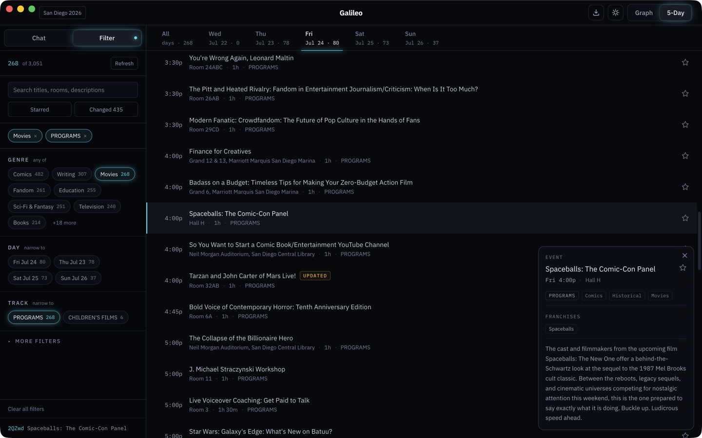
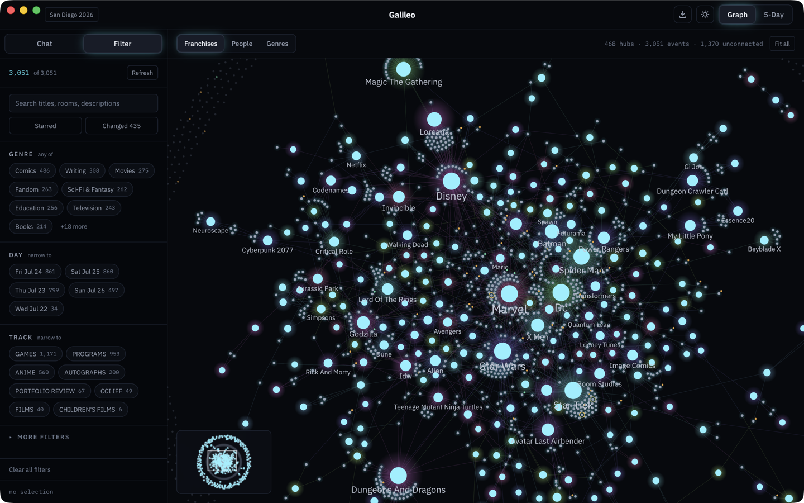
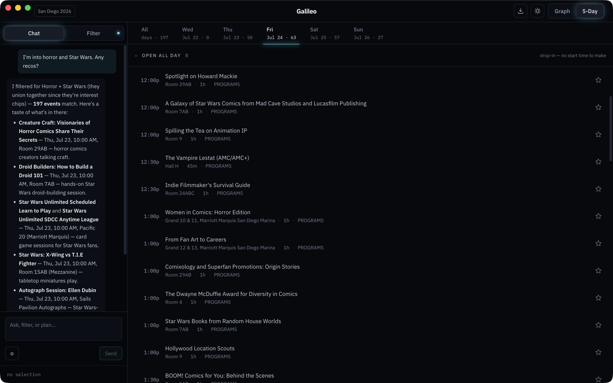

# Galileo

Chart your course through San Diego Comic-Con. Galileo is a desktop planner for the public program—fast filtering, a relatedness map across people and franchises, and calendar export to your phone.

> **Unofficial.** This project is not affiliated with, endorsed by, or connected to San Diego Comic Convention (Comic-Con International) or Sched. Convention program data is fetched from Sched's public endpoints at runtime for personal use and is **never committed to this repository**—see `.gitignore`. The AGPL-3.0 license (see `LICENSE`) covers the code only, not convention data.

## Install

Download the latest release for your platform from [Releases](https://github.com/wongdigital/galileo/releases):

- **macOS** (Apple Silicon, M-series) — open the `.dmg` and drag Galileo to your Applications folder.
- **Windows** — run the `.exe` installer. On first launch Windows may show a SmartScreen prompt; choose **More info → Run anyway**.

On first launch the app fetches the current schedule from Sched—give it a moment on a cold start. Everything except the chat concierge works with no account and no key; the concierge is optional and brings your own key ([below](#the-chat-concierge-bring-your-own-key)).

Want to build it yourself instead? See [For developers](#for-developers).

## What you can do

### Browse and filter

The main view is a five-day list of the whole public program. Filter by track, day, room, and sub-category to cut thousands of events down to the handful you care about, and star the ones you want to keep. Stars and filters persist between launches.



### The relatedness map

The second view is a map that connects the schedule by who and what is in it. **Entities**—a person, a franchise, a genre—are hubs sized by how many events they cover; **events** are dots; and a line joins each event to each entity it carries. A lens picks which kind of entity is drawn, and the map only ever shows what your current filter holds, so narrowing the list narrows the map.



Click a hub or a dot to pin it and open a card. It's the same card the list shows, so a starred, moved event looks identical whether you meet it as a row, as a dot, or on the map. Events no hub claims aren't hidden—they drift into a dim halo at the rim, still hoverable.

An event that repeats shows its other sittings as "Also runs" on its card.

### The chat concierge (bring your own key)

The Chat tab is an optional natural-language way to search, filter, and plan—"show me horror on Saturday", "who's on the Marvel panel", "star the Lucasfilm panel". It stays off until you add your own API key; browse, filter, map, and export need no key and no account.



Add a key in the Chat tab. Galileo works with Anthropic, OpenAI, or OpenRouter—you only need one. The key is encrypted at rest through the OS keychain (Electron `safeStorage`) and lives only in the main process: it never crosses into the renderer, and it never leaves your machine except in requests to the provider you picked.

### Export to your phone

Export starred sessions for a single day or the whole con. Import the generated `.ics` into a **dedicated calendar**, not your main one. To refresh after schedule changes, delete that calendar and re-import—event UIDs are stable, so unchanged events keep their identity.

Panels and screenings export with a 15-minute alarm. All-day and drop-in blocks (games tables, autograph lines) export without one—a 15-minute warning for a room that has been open since 10am is noise. Cancelled sessions and stars whose events have left the schedule are skipped, and the app names what it skipped rather than quietly exporting five of your six stars.

Times carry `TZID=America/Los_Angeles` on each event. Apple Calendar is the target; Google Calendar ignores imported alarms.

## Why I built this

With over 3,000 events across 5 days and 51 rooms at various venues, the Comic-Con schedule is a monster. Unfortunately, the official schedule is hard to use and navigate. So I built my own. Hope you like it. Reach out to me (hello@rogerwong.me) with questions or file an issue.

---

## For developers

### The hybrid data model (read this first)

This repo ships **code and derived facts**. It never ships Sched's program data.

| Committed | Local-only (gitignored) |
| --- | --- |
| Code | `data/events.json`, `data/meta.json` |
| `data/enrichment.json`—extracted people and franchise ids | App snapshots, star file |
| `data/facet-map.json`, `data/aliases.json`, `data/franchise-seed.json` | Enrichment batch request/response intermediates |
| Synthetic test fixtures | Live-corpus test fixtures |

Each instance fetches raw schedule data itself at runtime and joins it against the committed enrichment index. If you are tempted to "helpfully" commit `data/events.json` so others don't have to fetch it—don't. That file is Sched-authored prose and is the one thing this repo must not contain.

### Setup

```sh
npm install
node node_modules/electron/install.js   # if Electron's binary postinstall was skipped
npm run fetch                           # pull today's schedule
npm run dev                             # launch the app
```

Vite is pinned to `^7` and `@vitejs/plugin-react` to `^5`: electron-vite 5 peers Vite ≤7, while current defaults resolve Vite 8.

### Building the apps

```sh
npm run dist    # electron-vite build + electron-builder → dist/Galileo-<version>-arm64.dmg (+ .zip)
npm run pack    # unpacked .app in dist/ for a quick local check, no dmg
```

`npm run dist` produces an Apple Silicon macOS build. Signing and notarization are opt-in: with no Apple credentials in the environment the output is unsigned (ad-hoc), which is fine for local use. For a release, install a "Developer ID Application" cert in the keychain and export `APPLE_API_KEY` (path to an App Store Connect API `.p8`), `APPLE_API_KEY_ID`, and `APPLE_API_ISSUER`; the same `npm run dist` then signs and notarizes.

Windows packaging and cross-platform release builds via GitHub Actions are in progress; the published macOS and Windows binaries under [Releases](https://github.com/wongdigital/galileo/releases) come from that pipeline.

### Data pipeline

`npm run fetch` pulls the full schedule from Sched's public endpoints (2 requests, no auth) and writes a joined dataset:

- `data/events.json`—all events with title, Pacific-time start/end, track, sub-category tags, room, full description, and canonical Sched URL
- `data/meta.json`—fetch timestamp, counts, track list

Sources:

- `https://comiccon2026.sched.com/all.ics`—public iCal export: every event with UID, UTC times, track, room, full description
- `https://comiccon2026.sched.com/list/descriptions`—adds short event IDs and the sub-category taxonomy (Comics, Horror, Kids, 30 Minutes, etc.)

The two are joined by event UID. The CLI is a thin wrapper over `src/shared/schedule/`—the same parse/sanitize/join the app uses, so the two can't drift.

For a different year, set `SCHED_SITE` (e.g. `SCHED_SITE=https://comiccon2027.sched.com npm run fetch`).

#### Why the app diffs snapshots instead of trusting Sched's flags

Categories carry `NEW`/`UPDATED`/`CANCELLED` flags, but they are a static editorial annotation, not a change feed. Measured across two fetches 31 hours apart: the flag counts were byte-identical (86/11/1) while nine events changed title or description underneath them, and two events vanished from the feed without ever being flagged cancelled. So the app persists a snapshot each fetch and diffs prior→current per UID. See `docs/solutions/2026-07-18-uid-is-the-identity-key.md`.

### Maintainer runbook: compiling the enrichment index

Speaker and franchise data is not structured in Sched—names appear only inside description prose, and franchises mostly appear in descriptions rather than titles (Spider-Man is in 37 events but only 4 titles; Jurassic and Stranger Things in zero). A title string-match finds a fraction of the real connections, which is why this step exists.

Everything else—event classes, offering clusters, facets—is **deterministic and needs no compile step**. It is computed at runtime in `src/shared/enrichment/`. Only people and franchises come from the LLM.

Requires an `ANTHROPIC_API_KEY` in `.env` (gitignored). One full run costs roughly $4–5 and takes well under an hour.

```sh
npm run scan-franchises          # candidate franchises, ranked by Franchises-lens value
npm run enrich submit            # fire the batch
npm run enrich poll              # check status
npm run enrich merge             # validate spans, write data/enrichment.json
# or: npm run enrich run         # submit, wait, merge
```

**Reviewing the result before you commit it.** The index serializes deterministically, so a rerun should produce a small readable `git diff`. If a rerun rewrites the whole file, something changed in the schema or prompt—find out what before committing.

Check these after every compile:

- **Coverage by track, not in aggregate.** Aggregate people coverage is ~35% and that is expected: GAMES and ANIME are demos and screenings that name nobody. The number that matters is PROGRAMS (91%) and AUTOGRAPHS (100%).
- **The review bucket** (`data/review-bucket.json`, gitignored) holds spans rejected as non-verbatim—roughly 1% of extractions. Every extracted name and franchise surface must appear literally in the source text; anything that doesn't is a hallucination regardless of how plausible it reads, and never enters the index.
- **`other`-bucketed franchises.** About half of franchise mentions land in `other`, mostly long-tail anime and board-game titles. That's by design: `surface_text` is always preserved.

**Promoting an `other` to a canonical** does not require a batch rerun. Add the lowercased surface text to `data/aliases.json`:

```json
{ "franchises": { "mando": "star-wars" } }
```

Aliases are applied **last** in the merge, so a rerun never clobbers a correction.

**Curating `data/facet-map.json`.** 144 of Sched's ~181 sub-category tags map to facet dimensions. Unmapped tags surface in a review bucket rather than being silently dropped—most are guest names and small publishers used as sub-categories, which are correctly not facets. Add genuinely new tags as the con approaches; facets are applied at runtime, so con-week NEW events keep working facets without a recompile.

### How the entity map is built

The map is a bipartite graph: entities are hubs, events are dots, and one link joins each event to each entity it carries. It replaced an ego-network model that drew events only and connected two events sharing an entity. That shape does not survive the real corpus: a shared entity becomes a clique, so the Comics slice under the Franchises lens produced 659 links, a single 256-node component, and 215 isolated events. Linking through entities instead makes links scale linearly with the corpus rather than quadratically, and it makes "which programs is this person in" a dot you can point at. See `docs/plans/2026-07-19-001-feat-entity-map-graph-plan.md`.

Two rules keep the picture readable. An entity needs at least two in-scope events to be drawn at all—a franchise covering one event adds a dot and a line that say nothing the event's own label does not. And events no hub claims are never hidden; a weak radial force gathers them into a dim halo at the rim, where they stay hoverable like everything else.

An offering lens—hubs meaning "this same thing runs N times"—shipped and was retired: it deduped copies where every other lens relates different events. Its answer lives on the event card as "Also runs," listing the other sittings of a repeated program.

### Notes

- Event record shape: see `data/events.json`; `shortId` builds the public URL (`/event/<shortId>`), `uid` is the stable 32-hex identifier used for joins, diffs, stars, graph nodes, and exported calendar entries.
- `src/shared/` is pure—no I/O, no `node:` imports. All I/O lives in `src/main/`. This is what keeps the renderer's sandbox from ever needing to be relaxed.
