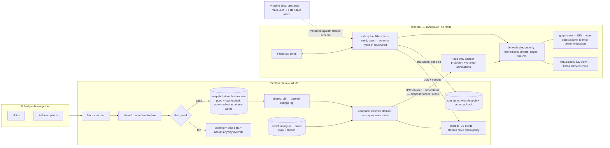

# feat: Relatedness Graph Schedule App

## Overview

Build an Electron desktop app over the existing SDCC data pipeline: a relatedness graph with switchable edge lenses as the discovery surface, a virtualized 5-day view for planning, persistent starring, and .ics export. Delivery is phased: **Phase A** is a 2-day sprint cut for personal use at SDCC 2026 (con starts July 22); **Phase B** is the full build (chat, polish, release readiness) afterward. The graph is the sprint's protected centerpiece; cut order if time runs short is chat → extra lenses → list polish (chat is already in Phase B).

---

## Problem Frame

Sched's tooling fails at SDCC's scale (3,476 events, 51 rooms, ~6 buildings, 181 flat tags). The requirements doc (see origin) defines a local-first, open-source app where each instance fetches raw schedule data from Sched's public endpoints and joins a repo-shipped enrichment index of derived facts (people, franchises, facets, offering clusters, event classes). No server, no accounts; chat is BYO-API-key. Visual direction: "The Observatory"—dark instrument, luminous nodes, precision type.

---

## Requirements Trace

R1–R19 carried from origin (see origin: `docs/brainstorms/2026-07-17-relatedness-graph-requirements.md`): instance-side raw fetch (R1), repo ships derived index only (R2), maintainer compile with graceful degradation (R3), change flags in-view (R4), ego-network graph (R5), switchable lenses (R6), animated transitions (R7), dim fringe (R8), edge explanation (R9), graph⇄5-day toggle with shared state (R10), persistent UID-keyed stars (R11), Filters sidebar as single source of truth (R12), .ics export with alarms (R13), key-gated chat (R14), chat compiles state not prose (R15), Observatory aesthetic (R16), craft bar (R17), naming/disclaimer (R18), license and polite fetching (R19).

**Origin actors:** A1 (Roger: user, maintainer, compile operator), A2 (keyless OSS user), A3 (keyed OSS user), A4 (Sched, external source)
**Origin flows:** F1 (first run), F2 (graph discovery), F3 (chat filter compile), F4 (export to con floor)
**Origin acceptance examples:** AE1 (covers R1–R3), AE2 (covers R6, R7), AE3 (covers R14), AE4 (covers R4, R11), AE5 (covers R13)

---

## Scope Boundaries

### Deferred for later

Carried from origin: chat tab is Phase B (first cut from sprint); walkability and my-picks lenses; queue/getability modeling, room-residency, leave-time board; triage states beyond starring; person profile pages; volatility scores; taste profiles; plan sharing; con-agnostic support for other Sched cons; app auto-update.

### Outside this product's identity

Carried from origin: any central server, hosted service, accounts, or telemetry; funding other users' LLM usage; a mobile app (phone is served by exported artifacts); auto-generated itineraries; official CCI/Sched affiliation or branding.

### Deferred to Follow-Up Work

- Starred-event conflict indicators in the 5-day view: full build (Phase B), per flow analysis—Roger can eyeball six stars/day during the sprint.
- Field-level change diffs (what exactly moved): Phase B; sprint ships coarse moved/cancelled flags from the snapshot diff.
- Enrichment coverage display ("index covers N of M"): Phase B; index carries `compiledAt` + counts from day one.

---

## Context & Research

### Relevant Code and Patterns

- `scripts/fetch.mjs` — working two-request fetch + iCal/HTML parse + UID join; refactor its logic into a shared library consumed by both the CLI and the Electron main process.
- `data/meta.json` — already computes `fetchedAt` and `joinedWithListView` (3,476/3,476 today); the drift-guard thresholds build on these.
- Live data facts that shape units: 420 events ≥6h, 45 cross midnight, 464 repeated titles (offering-cluster fodder), 1 CANCELLED / 86 UPDATED / 11 NEW flags in the current feed, and one live data error ("Dice Throne" with DTEND in 2028) that makes export sanitization a testable requirement.

### Institutional Learnings

- None — new repo, no `docs/solutions/`. First candidates to capture post-sprint: enrichment index format, lens-switch layout technique.

### External References

- Graph: `react-force-graph-2d` (d3-force engine; object constancy is automatic when node object identity persists across `graphData` swaps; `d3ReheatSimulation()` with alpha ~0.4, not 1.0; pin seed via `fx/fy`; seed new nodes at neighbor positions to avoid streak-in).
- Scaffold: electron-vite v5 (`create @quick-start/electron`, react-ts template) + electron-builder; Electron security defaults (contextIsolation, sandbox, no nodeIntegration); one named IPC method per channel via contextBridge; Forge's Vite plugin still experimental—avoid.
- List: `@tanstack/react-virtual` (headless fits custom Observatory styling; virtualize the active day only).
- Components: shadcn/ui (copy-in Radix-based source) + Tailwind v4 CSS-variable theming; cmdk (bundled with shadcn's command component) as a candidate foundation for chat/search input.
- Enrichment: Claude Message Batches API (single batch fits 3,476 requests; ~<1h turnaround; 50% discount), model `claude-haiku-4-5-20251001` pinned, structured outputs GA via `output_config.format` json_schema; enum-constrained canonical franchises; verbatim-substring validation on extracted names (langextract-style grounding); est. ~$5/run.
- ICS: `ical-generator` v11 (VALARM support, per-event `timezone: 'America/Los_Angeles'`; VTIMEZONE needs the optional `@touch4it/ical-timezones` peer—bare TZID suffices for Apple Calendar); Google Calendar ignores imported VALARMs—Apple Calendar is the target.
- Chat (Phase B): Electron `safeStorage` in main process (plaintext never enters renderer; main-process HTTP also sidesteps CORS); Vercel AI SDK v7 (ESM-only, Node 22) with `@ai-sdk/openai`, `@ai-sdk/anthropic`, `@openrouter/ai-sdk-provider`.

---

## Key Technical Decisions

- **Shared schedule library, two consumers:** fetch/parse/join logic moves to `src/shared/`; the CLI script and Electron main both import it. Rationale: one tested implementation of the R1 pipeline instead of drift between script and app.
- **Snapshot-and-diff is the change engine:** every successful fetch persists to app data; refresh diffs prior→current per UID to derive moved/cancelled/new beyond Sched's coarse flags, and the prior snapshot doubles as the offline/drift fallback (R4, flow-analysis gaps 3–5). One mechanism, three requirements.
- **Star records snapshot event fields** (title/start/room/starredAt), not bare UIDs: a UID vanishing from the feed renders as a visible ghost star instead of silent data loss—the exact Sched failure class this app exists to fix (R11).
- **Facet mapping ships as a runtime tag→facet table** (not precomputed per-UID): con-week NEW events keep working facets automatically; only People/IP degrade until the next maintainer compile (R3's "heuristic treatment," made concrete).
- **Event classes and offering clusters are deterministic, not LLM:** duration+track heuristics for attend/ambient; normalized-title grouping for offerings (464 repeated titles prove the signal). LLM extraction is reserved for people and franchises where it's genuinely needed. Cheaper, testable, re-runnable.
- **Enrichment index format:** versioned envelope (`schema_version`, `generated_at`, model snapshot + prompt hash provenance), UID-keyed entries, explicit empty-array entries for processed-but-empty events (absence = not yet enriched), deterministic serialization for reviewable diffs. `data/aliases.json` is hand-maintained and merged last—reruns never clobber corrections.
- **Manual refresh in the sprint,** state keyed by UID surviving the swap; automatic scheduling is Phase B. Closes the refresh-under-open-state problem cheaply.
- **ICS: bare IANA TZID `America/Los_Angeles`, stable UIDs (`<sched-uid>@<app>`),** ambient-class events export without alarms, sanitized durations inherited from U3's clamp rule, dedicated-calendar re-import instruction for dedupe. Bare TZID is sufficient for the Apple Calendar target; VTIMEZONE emission requires the optional `@touch4it/ical-timezones` peer and is a nice-to-have, not a claim.
- **Component layer: shadcn/ui + Tailwind v4, token-driven theming.** shadcn is copy-in Radix-based source (ownable, carveable, accessible focus/keyboard/ARIA plumbing free), covering the chrome: dialogs, tabs, dropdowns, switches, toasts, tooltips, settings forms. The Observatory design tokens are CSS variables that *are* the Tailwind theme, so components render dark-instrument from the first paint. Identity surfaces (graph canvas, timeline rows, filter chips, lens selector) are custom components on the same tokens. Guard: nothing ships looking like stock shadcn (enforced in U9). Alternatives weighed: raw Radix + hand-rolled CSS (same foundation, ~half-day premium), Mantine/Chakra (visually opinionated, fights the craft goal).
- **Filter semantics: interests union, constraints intersect.** Genre, IP, and people terms accumulate as OR ("show me any of these"); day, venue, duration, time band, and audience narrow as AND. "Horror and Star Wars, Saturday" = (Horror ∪ Star Wars) ∩ Saturday. Encoded once in the shared filter engine; chips and chat inherit it identically.
- **Raw Sched data never enters git:** `.gitignore` covers raw fetch outputs before the repo's first commit (R2 legal posture; flow-analysis critical gap 1). This extends to **test fixtures and batch intermediates**: live-corpus fixtures (which contain Sched prose) are gitignored and regenerated locally via a fixtures script; committed tests use synthetic/redacted fixtures only.
- **Isomorphic core rule:** everything in `src/shared/` is pure functions over strings/objects—no I/O, no `node:` imports. All I/O (fetch execution, snapshot store, star store, dialogs) lives in `src/main/`. Prevents the classic shared-folder failure that pressures sandbox relaxation.
- **Main owns the canonical enriched dataset; renderer holds a read-only projection.** Main performs fetch → sanitize → join → diff → enrichment merge and ships dataset + per-UID change annotations over IPC. Snapshots never cross IPC—the renderer has no snapshot concept. ICS export is `{uids, options}`; main resolves from its canonical copy (export can never diverge from app data).
- **Change flags persist via an unseen-change log,** not just latest-two-fetch diffs: diff results accumulate per UID and clear on acknowledgment, so a moved/cancelled flag survives a second refresh instead of evaporating before it's seen (AE4).
- **Two snapshot slots—last-known-good and last-fetched—plus a user override** ("accept new data anyway") on the drift warning: a degraded-but-passing fetch can't poison the guard baseline, and a legitimate mass change can't wedge the app. Snapshots carry a `schemaVersion` and use atomic temp+rename writes, same as the star store.
- **Filter/lens state schema lives in `src/shared/`,** consumed by both renderer chips and (Phase B) the main-process chat compiler—R15's "chat produces the same state" holds definitionally, not by convention. Chat-addressable fields: filters + lens; not seed/stars.
- **Star snapshot fields are ghost-display-only**—never merged into live event data—and star writes are echo-back: `stars:set` returns the persisted list and the renderer adopts it, so a failed write is visible, not a silent restart-time loss (R11).

---

## Open Questions

### Resolved During Planning

- Star file schema: UID + snapshot fields (see decisions).
- Facet mapping form: runtime tag→facet table.
- Change detection: persist-and-diff, not Sched flags alone.
- Re-export dedupe: stable UIDs + dedicated-calendar instruction; per-day export granularity.
- Ambient alarms: none for ambient-class events.
- Refresh model: manual for sprint.
- Graph stack: `react-force-graph-2d` for sprint (hand-rolled d3+SVG remains the Phase B upgrade path if aesthetic ceiling demands it).

### Deferred to Implementation

- Exact force-tuning values (alphaDecay, velocityDecay, collide radius): needs live feel-testing against real data.
- Offering-cluster similarity threshold: tune against the 464 repeated titles during U4.
- Franchise canonical vocabulary: seeded by a day-one corpus scan as a U11 prerequisite, then curated; `other`-bucketed surfaces are promoted via `aliases.json` between compiles.
- App name (origin: user decision, pre-release): blocks nothing in Phase A; must be settled in U10.

---

## Output Structure

    galileo/
    ├── .gitignore                     # data/raw*, snapshots, keys — before first commit
    ├── electron.vite.config.ts
    ├── package.json
    ├── scripts/
    │   ├── fetch.mjs                  # thin CLI over src/shared (existing, refactored)
    │   └── enrich.mjs                 # maintainer compile (batch LLM + deterministic passes)
    ├── data/
    │   ├── enrichment.json            # committed derived index (envelope format)
    │   ├── facet-map.json             # hand-curated tag→facet table (committed)
    │   └── aliases.json               # hand-maintained canonicalization overrides (committed)
    ├── src/
    │   ├── shared/                    # types, fetch/parse/join, diff, sanitize, classes/offerings
    │   ├── main/                      # Electron main: fetch IPC, snapshot store, ICS save
    │   ├── preload/                   # contextBridge, one named method per channel
    │   └── renderer/
    │       ├── state/                 # filters, lens, stars, dataset
    │       ├── views/graph/           # ego network, lenses, fringe, edge inspector
    │       ├── views/schedule/        # virtualized 5-day view
    │       └── sidebar/               # Filters tab (Chat tab in Phase B)
    └── tests/                         # colocated or here, per scaffold convention

*Scope declaration, not a constraint—the implementer may adjust if a better layout emerges.*

---

## High-Level Technical Design

> *This illustrates the intended approach and is directional guidance for review, not implementation specification. The implementing agent should treat it as context, not code to reproduce.*

**Artifact trust zones:** *committed to repo* — code, `data/enrichment.json`, `data/facet-map.json`, `data/aliases.json`, synthetic test fixtures. *Local-only, gitignored* — `data/events.json`, `data/meta.json`, snapshots, star file, keys, batch request/response intermediates, live fixture corpus. *Maintainer-side flow* — `scripts/enrich.mjs` → batch → validate → alias merge → committed index.

**Invariants:**
1. `src/shared/` is pure (no I/O); all I/O in main; renderer never touches Node.
2. Main is the single owner of the canonical enriched dataset; the renderer holds a projection; snapshots never cross IPC.
3. The spine stores inputs only; every projection (ghosts, flags, edges, filtered sets) is derived, never stored. Identity across refresh is UID everywhere—except the graph's node-object cache, which exists precisely to translate UID identity into the object identity d3-force requires.

---

## Implementation Units

**Sprint execution order:** U1 → (U2 ∥ U3, with U11's LLM batch fired on day one against the existing `data/events.json`) → U4 → U5 → **U7 → U6**. U7 precedes U6 deliberately: the origin's success criterion is "starred list + .ics before preview night" (U5+U7), U7 is hours, and real-device iPhone verification must not happen the night of July 21. The graph (U6) remains the protected centerpiece and receives all remaining time—protected concretely, not rhetorically: U6's pure edge builders are not gated on U5 and are built test-first in parallel once U4's schema exists, and the **minimum protected graph cut** is defined now rather than under pressure—one flagship lens (IP if U11 has landed, else facets), seed + ego expansion + edge inspector, no fringe or animation polish. Schedule slip degrades the graph to that cut; it never deletes it. Document order below is unchanged; U-IDs are stable.

### Phase A — Sprint (target: usable before July 22)

- U1. **Repo safety and first commit**

**Goal:** Make it impossible to leak Sched prose into git history; land the repo's first commits.

**Requirements:** R2, R19

**Dependencies:** None. **Precedes all other commits.**

**Files:**
- Create: `.gitignore`
- Modify: `README.md` (unofficial disclaimer, data-not-licensed note)

**Approach:** Ignore all known prose-bearing paths up front—raw fetch outputs (`data/events.json`, `data/meta.json`), snapshot files, **live-corpus test fixtures, and enrichment batch request/response intermediates**—plus OS/build noise and key/config files. The ordering constraint is the requirement: these paths must be ignored *before* the first enrich run or fixture generation, not merely "eventually." Commit pipeline, docs, and README with disclaimer. Permissive license file may land here or in U10 with the name decision.

**Test scenarios:**
- Test expectation: none — configuration-only unit. Verification is the check below.

**Verification:** `git status` after a full fetch run shows no raw data files as untracked-and-addable; first commits contain no Sched-authored description text.

---

- U2. **Electron scaffold and Observatory foundation**

**Goal:** Running Electron shell with secure process layout, theme tokens, and the two-view app frame.

**Requirements:** R10 (frame), R16 (foundation)

**Dependencies:** U1

**Files:**
- Create: `electron.vite.config.ts`, `src/main/index.ts`, `src/preload/index.ts`, `src/renderer/` app frame, theme tokens module
- Modify: `package.json`

**Approach:** electron-vite v5 react-ts scaffold; keep default security posture (contextIsolation, sandbox, no nodeIntegration); IPC surface starts with `schedule:refresh` and `export:ics` stubs, one named method per channel. **Component layer: Tailwind v4 + shadcn/ui initialized here**—Observatory tokens defined once as CSS variables (dark ground, luminous accents, type scale) and wired in as the Tailwind theme, so every shadcn component (dialogs, tabs, dropdowns, toasts, settings) is dark-instrument from first render; identity surfaces stay custom on the same tokens. View toggle skeleton (graph ⇄ 5-day) with shared state container.

**Test scenarios:**
- Test expectation: none — scaffolding unit; behavior arrives with U3/U5/U6. Smoke: app launches, toggle switches empty views.

**Verification:** `electron-vite dev` launches the themed shell; renderer has no Node access; toggle preserves a dummy selection across views.

---

- U3. **Schedule data layer: shared lib, runtime fetch, snapshot diff, guards**

**Goal:** The R1 pipeline as a tested library: fetch → parse → sanitize → join → diff, powering both CLI and app.

**Requirements:** R1, R3 (join/degrade), R4 (diff basis), R19 (polite fetch)

**Dependencies:** U2 (for IPC wiring; library itself only needs U1)

**Files:**
- Create: `src/shared/schedule/` (parse-ics, parse-list, sanitize, join, diff, types—pure, no fetch here), `src/main/fetchExecutor.ts`, `src/main/snapshotStore.ts`, tests under `src/shared/schedule/__tests__/`
- Modify: `scripts/fetch.mjs` (thin CLI wrapper)

**Approach:** Port `scripts/fetch.mjs` logic into typed modules (pure—see isomorphic core rule). Fetch *execution* deliberately exists twice—~10 lines in `src/main/fetchExecutor.ts` for the app and inline in `scripts/fetch.mjs` for the CLI—both calling the shared parse/sanitize/join pipeline (matches the mermaid; the shared lib itself does no I/O). The CLI consumes the TypeScript shared lib via a `tsx` devDependency (`tsx scripts/fetch.mjs`)—Node 22 cannot import `.ts` unflagged. Sanitize pass: implausible DTENDs (beyond con end, or duration >12h outside ambient tracks) clamp to same-local-day end or DTSTART+12h—not con-end+1day, which would turn the live 2028 case into a multi-day banner; con-end+1day remains only the outer validity check. Rooms normalized. Snapshot store (main, userData) keeps **two slots: last-known-good and last-fetched**, each with `schemaVersion` envelope and atomic temp+rename writes. Diff computes per-UID added/removed/moved(start|room)/flag-changed and **accumulates into an unseen-change log** that survives subsequent refreshes; acknowledgment is a per-UID dismiss on the flagged row via a `changes:acknowledge(uids)` IPC channel, with acks persisted in main alongside the log. Drift guard: join rate <90% or event count drop >20% vs last-known-good → keep prior data, surface warning **with an "accept new data anyway" override**. Fetch failures fall back to last-known-good with `fetchedAt` staleness surfaced; first-run-offline renders an explicit empty state. Diffing happens in main; renderer receives dataset + change annotations only. Honest user agent, two requests per refresh, no retry storms. This unit's library work depends only on U1 and runs **in parallel with U2**; only the IPC wiring gates on U2.

**Execution note:** Port test-first—characterize against a live fixture corpus (today's fetch) locally. **Day-one check:** refetch ~24h after the current snapshot and assert UID persistence across Sched edits (the 86 UPDATED events are the test population)—five subsystems key identity to UIDs, and if they churn on edit, switch the identity key to the list-view `shortId` and record the decision before U3 builds on the wrong key. Live fixtures are gitignored (they contain Sched prose; see U1); committed tests use synthetic/redacted fixtures, and a `fixtures` script regenerates the live corpus on any machine.

**Test scenarios:**
- Happy path: fixture ICS + list HTML → 3,476 joined events, join rate 100%, categories/flags parsed (Covers AE1 data half).
- Happy path: diff of two fixture snapshots → detects a moved start, a moved room, a removed UID, an added UID, a flag change.
- Edge case: "Dice Throne" 2028 DTEND fixture → clamped, flagged as sanitized.
- Edge case: midnight-crossing event retains correct local date bucketing.
- Error path: fetch failure with prior snapshot → prior data returned, staleness set; without prior snapshot → explicit empty-state result.
- Error path: list HTML parse returning near-empty map → drift guard keeps prior snapshot, warning surfaced; override accepts the new data explicitly.
- Edge case: two consecutive refreshes after a move → unseen-change log still reports the move until acknowledged (flags are not one-refresh ephemeral).
- Edge case: snapshot with older `schemaVersion` → explicitly migrated or discarded, never a mystery crash in the fallback path.
- Integration: `schedule:refresh` IPC round-trip updates renderer dataset while preserving a starred selection keyed by UID.

**Verification:** CLI produces today's known-good output via the shared lib; app cold-start fetches live data; kill-network refresh shows stale-data banner, not a blank app.

---

- U4. **Enrichment index: schema and deterministic passes**

**Goal:** The index format plus everything derivable without an LLM: event classes, offering clusters, facet mapping. Unblocks U5's shelves and U6's facets/offering lenses without waiting on the batch.

**Requirements:** R2, R3; feeds R6 (facets, same-offering lenses)

**Dependencies:** U3 (shared types/parse)

**Files:**
- Create: `src/shared/enrichment/` (index schema, join, deterministic passes: classes, offerings, facet application), `data/facet-map.json`, `data/aliases.json` (seeded empty), tests under `src/shared/enrichment/__tests__/`

**Approach:** Envelope with `schema_version`, `generated_at`, provenance, per-entry status; explicit empty-array entries for processed-but-empty events (absence = not yet enriched); deterministic serialization for reviewable diffs. Event class from duration+track (≥4h drop-in tracks → ambient); offering clusters from normalized title equality within track (464 repeated titles). Per-entry **description content hash** in the index: at join time, a live description whose hash differs from the compiled hash is treated like an absent entry—people/IP degrade, facets survive via the runtime table (origin R3's "changed since last compile," made mechanical; 86 events already carry UPDATED flags).

The facet model is a first-class design deliverable, not tag cleanup. **Curated dimensions** (in `data/facet-map.json`, applied at runtime so con-week NEW events keep facets): genre/topic (~40 tags: Horror, SF&F, Comics, Superheroes, TV, Movies, Anime & Manga, Writers & Writing...), format (panel/screening/workshop/signing/spotlight/awards; game formats Board/RPG/CCG-TCG/miniatures), audience age (the 7+/8+/10+/13+/Kids/All-Ages mess normalized to four bands), community (BIPOC, LGBTQIA+, International), player count (games; "2-4 Players" → supports-N range). **Computed dimensions** that never trust tags: day, time band, duration band, building—tags like "45 Minutes"/"Evening"/"Marriott Programs" map for validation only; the UI uses computed values. IP/franchise and people arrive from U11. Filters UI: primary rail (day, track, genre, IP), remaining dimensions behind "more filters."

**Test scenarios:**
- Happy path: event class heuristic → 50-min panel = attend, 6h Games block = ambient (fixture both).
- Happy path: offering clustering groups the repeated-title fixtures; conflict logic input shows N sessions per offering.
- Edge case: unmapped tag falls through visibly (review bucket), not silently dropped.
- Happy path: "8+"/"10+"/"Kids" normalize into the four audience bands; player-count "2-4 Players" matches a works-for-3 query and rejects works-for-6.
- Edge case: index entry whose description hash mismatches the live description → people/IP degraded, facets still applied.
- Integration: app joins index → an event absent from index degrades to facets-only (runtime tag table still applies).

**Verification:** Index loads in-app with classes, offerings, and facets live before any LLM output exists.

---

- U11. **Enrichment compiler: LLM batch (people + franchises)**

**Goal:** `scripts/enrich.mjs` runs the maintainer-side Message Batch and merges validated people/franchise extractions into `data/enrichment.json`.

**Requirements:** R2, R3; feeds R6 (people, IP lenses); AE1

**Dependencies:** U1 (`.gitignore` covers batch intermediates—hard ordering constraint). **Not** gated on U2–U4: the batch consumes the existing `data/events.json`, so **fire it on day one** with a thin adapter; results land while U2–U5 are built, and the index-merge step aligns with U4's schema when both exist.

**Files:**
- Create: `scripts/enrich.mjs`, `data/enrichment.json` (generated), batch validation tests under `src/shared/enrichment/__tests__/`
- Modify: `data/aliases.json` (curation), `data/facet-map.json` if corpus scan surfaces gaps

**Approach:** One Message Batch on pinned `claude-haiku-4-5-20251001`, structured outputs: people as verbatim spans with roles; franchises as `{surface_text, canonical}` with canonical constrained to an enum **plus an `other` escape value** (surface text always preserved)—entities missing from the seed enum land in the review bucket and get promoted to canonicals via `aliases.json` between compiles, no batch rerun needed. The seed-enum corpus scan is a **day-one U11 prerequisite**, not a U4 deliverable. Explicit empty-arrays-allowed instruction. Post-validate every span is a literal substring of its description—reject or bucket failures for review. Merge order: LLM output → normalize → `aliases.json` overrides → review bucket for unmapped; reruns never clobber alias corrections. Batch request/response intermediates stay gitignored (they contain Sched prose).

**Test scenarios:**
- Happy path: fixture batch results → index entries with people/franchises populated; empty-result event gets explicit empty arrays.
- Edge case: extracted span not present verbatim in description → rejected to review bucket, not indexed.
- Edge case: franchise surface "Mando" with alias entry → canonical `star-wars` after merge; rerun preserves the alias correction.
- Error path: batch item `errored` → retry pass targets only failed custom_ids; index marks entry status.

**Verification:** One real compile run lands `data/enrichment.json` with >90% people/IP coverage; `git diff` on a rerun is small and reviewable; cost within ~$10; committed index contains no Sched prose (extracted spans and canonical IDs only).

---

- U5. **5-day view, filters, starring, change flags**

**Goal:** The planning surface: virtualized day list, facet filter chips, persistent stars with ghost handling, flags in-view, manual refresh.

**Requirements:** R4, R10, R11, R12; F1 outcome

**Dependencies:** U2, U3; facets need U4's `facet-map.json` (runtime table works before the LLM index lands)

**Files:**
- Create: `src/renderer/views/schedule/` (day list, event card, day switcher), `src/renderer/sidebar/FiltersTab.tsx`, `src/renderer/state/` (filters, stars, dataset), `src/main/starStore.ts`, tests alongside
- Modify: preload (star + refresh + `changes:acknowledge` channels)

**Approach:** TanStack Virtual over the active day (~1,000 rows max); ambient-class events render as a collapsed "open now/all day" shelf per day rather than list rows (event classes from U4's deterministic pass). Filter chips per facet dimension; zero-result state names the active chips. Stars persist via main-process store (plain JSON, UID + snapshot fields, echo-back ack: renderer adopts the persisted list `stars:set` returns). Ghost stars render struck-through when their UID leaves the feed; ghost snapshot fields are display-only, never merged into live data. NEW/UPDATED/CANCELLED render as row states from the unseen-change log; starred+cancelled is loud (AE4). Manual refresh button; all view state keyed by UID survives the swap—**scroll anchors to a UID, not a list index** (the filtered array changes length on refresh). All projections (ghosts, flags, filtered sets) are derived selectors over the spine, never stored copies.

**Test scenarios:**
- Happy path: filter genre=Horror + day=Sat → count matches fixture expectation; chips visible; clearing restores.
- Happy path: star an event, restart app → star present (Covers AE4 persistence half).
- Edge case: starred UID removed from feed → ghost star rendered, not dropped (Covers AE4 spirit).
- Edge case: zero-result filter combo → empty state naming active chips, one-click clear.
- Error path: refresh failure mid-session → stale banner, list intact, scroll preserved.
- Integration: refresh with a moved starred event → star follows the UID, row flagged moved, scroll/selection preserved (Covers AE4).

**Verification:** Roger can triage a real day to a starred list without losing state across filters, view switches, refreshes, or restarts.

---

- U6. **The Relatedness Graph** — SUPERSEDED 2026-07-19

> **Superseded by `docs/plans/2026-07-19-001-feat-entity-map-graph-plan.md`.**
>
> U6 was built and shipped as designed. Measured against the real corpus, the
> ego model failed at its own job: a shared entity becomes a clique (Comics + IP:
> 659 links, one 256-node component, 215 isolates), multi-entity events weld
> clusters together, and the seed-prompt interaction confused its one user. The
> replacement is a bipartite event↔entity map — entities as sized hubs, events as
> dots, the active filter as the only scope. The seed model, the ego layer, and
> the edge inspector are deleted rather than kept as a mode.
>
> Everything below is retained as the record of what was built and why, not as a
> description of the current app.

**Goal:** The centerpiece: ego-network with switchable lenses, animated transitions, fringe, edge inspection.

**Requirements:** R5–R9, R10; F2

**Dependencies:** U4 (facets/offering lenses), U11 (people/IP lenses—graph ships with whatever lenses have data), U5 (shared state/starring). Runs last in the sprint by design: U7 precedes it (see sprint execution order), and it receives all remaining time.

**Files:**
- Create: `src/renderer/views/graph/` (GraphView, edge builders per lens, lens selector, fringe, edge inspector, seed control), edge-builder tests
- Modify: sidebar (lens selector in Filters tab), state (lens, seed)

**Approach:** Edge builders derive per-lens edge sets from the enrichment join: people (shared extracted person), IP (shared canonical franchise), facets (shared genre-dimension facet; tune to avoid degenerate density), offering (same cluster). `react-force-graph-2d`: node objects persist across lens switches (object constancy), links swap, `d3ReheatSimulation()` at alpha ~0.4; seed pinned via fx/fy; new nodes spawn at neighbor positions. **Dataset refreshes need the same treatment as lens switches:** a `Map<uid, nodeObject>` cache mutates existing node objects in place on dataset swap and only creates/removes objects for genuinely added/removed UIDs—otherwise a manual refresh with the graph open re-enters every node and detonates the layout. Ego expansion 1–2 hops capped; filter-result seeding capped at ~30 (prompt to narrow beyond). **No-seed entry state** (toggling to the graph with nothing selected): a designed prompt state offering seed candidates—recent stars and the current filter result—never an empty canvas and never the whole corpus. Fringe: nodes with zero edges under active lens dim toward the rim. Zero-edge seed renders alone with per-lens edge counts as escape hatch ("no IP connections—People has 4"). Edge click opens the **inspector as a docked non-blocking side panel** (updates in place, dismisses on click-away or re-click, never blocks node-click re-seed or lens switching), naming the shared entity. Starred and NEW/UPDATED/CANCELLED states render as **lens-independent node encodings** (star = ring; updated/moved = amber mark; cancelled = struck/desaturated) so AE4's "both views" clause holds in the graph, consistent with the list's treatment. Node click re-seeds; starring works in-graph. Canvas glow via shadowBlur—Observatory look from day one.

**Execution note:** Build edge builders test-first against fixture index data; the rendering layer is feel-tested live.

**Test scenarios:**
- Happy path: seed a panel under people lens → neighbors share ≥1 extracted person; edge inspector names them (Covers AE2 setup, R9).
- Happy path: lens switch people→IP on same seed → node set persists where entities overlap, links change (Covers AE2).
- Edge case: seed with zero edges under active lens → solo node + per-lens counts hint.
- Edge case: graph opened with no active seed → prompt state with seed candidates; never empty canvas, never full corpus.
- Integration: starred event cancelled → node shows cancelled encoding with star ring intact, matching the list (AE4 in-graph).
- Edge case: fringe contains exactly the zero-edge neighbors under the active lens (R8).
- Edge case: filter-seed of 1,173 Games events → capped with narrow prompt.
- Integration: star from graph → appears starred in 5-day view instantly (R10 shared state).
- Integration: manual refresh while graph is open → node positions persist for surviving UIDs; no layout explosion; removed UIDs exit gracefully.

**Verification:** Lens switching visibly reorganizes clusters without node teleport/explosion at ~150 nodes; Roger discovers a session via the graph he hadn't found by list.

---

- U7. **ICS export**

**Goal:** Starred sessions → .ics importable into Apple Calendar with sane alarms.

**Requirements:** R13; F4; AE5

**Dependencies:** U5 (stars); U4 (ambient classes for alarm policy). Runs **before U6** (see sprint execution order)—it closes the origin's minimum success criterion and needs real-device verification lead time. Export resolves from main's canonical dataset (`{uids, options}` over IPC).

**Files:**
- Create: `src/shared/ics/` (builder + tests), `src/main/icsExport.ts` (save dialog + write)
- Modify: preload (export channel)

**Approach:** `ical-generator` v11; TZID `America/Los_Angeles` with VTIMEZONE; stable UIDs `<sched-uid>@<app-slug>`; per-day and whole-con export options; VALARM lead time default 15 min (attend-class only; ambient-class exports without alarms); DTEND sanitization inherited from U3; ghost/cancelled stars excluded with a notice. README/UI line: import into a dedicated calendar; delete-and-reimport to refresh.

**Test scenarios:**
- Happy path: 6 starred Saturday sessions → 6 VEVENTs, TZID LA, VALARM -PT15M each (Covers AE5).
- Edge case: starred ambient 6h block → exported without VALARM.
- Edge case: cancelled starred event → excluded, export summary notes it.
- Edge case: re-export after changes → identical UIDs for unchanged events (dedupe-stable).
- Error path: save dialog cancelled → no file, no error state.

**Verification:** Import on an iPhone shows correct local times and firing alarms (Covers AE5, real device).

---

### Phase B — Full build (post-con)

- U8. **Chat tab: tool-using concierge**

**Goal:** Key-gated chat where the model grounds schedule facts in app tools, drives the same filter/lens state as the chips, and answers world-knowledge and judgment questions directly.

**Requirements:** R14, R15; F3; AE3

**Dependencies:** U5, U6

**Files:**
- Create: `src/renderer/sidebar/ChatTab.tsx`, `src/main/llm/` (provider client, safeStorage key store, tool loop), `src/shared/chat/` (tool schemas, state-patch types + tests)
- Modify: preload (chat + key channels)

**Approach:** Keys via `safeStorage` in main, plaintext never in renderer; LLM calls from main (CORS-free). Vercel AI SDK v7 (ESM main—electron-vite v5 handles it) with OpenAI/Anthropic/OpenRouter providers, tool-use loop. **Grounding rule: schedule facts come only from tools, never from model memory.** Tools: `apply_filters` (state patch: facet add/remove/replace, negation on constraints, text-search chip, time-anchor "now+window", flag and star filters, day/view/lens commands, clear/undo), `search_events`, `get_event`, `get_starred`. Filter intents take the fast path—one compile, chips update, and the reply carries the engine-computed count ("173 programs match Horror and Star Wars—filtered"); counts are never model-generated. World knowledge and judgment (franchise lore, Hall H line strategy, walking-time sanity) answered directly, advice framed as advice. Content questions ("who's on this panel?") answered from `get_event` results with the event card rendered alongside—the model reads the source, the UI shows it. Mutations (star, export) only via a proposed-action confirm card listing the exact events; one tap commits. Event descriptions flow to the user's chosen provider by design (their key, their data path)—documented, deliberate. Un-compilable or off-domain-destructive requests get typed refusals; the taxonomy is now just two rules: no schedule facts from memory, no mutation without confirmation. Disabled tab with one-line explanation until a key exists; enabling requires no restart (AE3).

**Test scenarios:**
- Happy path: "I'm interested in horror and Star Wars" → genre ∪ franchise chips set (interests union); reply carries engine-computed count (F3).
- Happy path: "rearrange to show IP connections" → lens state switches.
- Happy path: "who's on the Lucasfilm panel?" → `search_events`/`get_event` called; answer cites tool result; event card rendered.
- Happy path: "will I get into Hall H Saturday?" → direct advice answer, framed as advice, no fabricated schedule facts.
- Edge case: "nothing before noon, not the Marriott" → negated constraint chips.
- Edge case: compiled state matches zero events → deterministic relaxation hint ("removing X gives you 12").
- Edge case: "star those three" → confirm card listing the three exact events; nothing committed without the tap.
- Error path: invalid key → 401 surfaced in-tab; chat disabled state returns.
- Integration: key added via settings → tab enables without restart (Covers AE3).

**Verification:** All three providers drive identical state from the same utterance; schedule-fact answers trace to tool calls in the loop log; key survives app restart encrypted.

---

- U9. **Observatory elevation pass** — BRIEF SHRUNK 2026-07-19

> **Narrowed by `docs/plans/2026-07-19-001-feat-entity-map-graph-plan.md` (R13).**
>
> The entity map pulled the legibility half of this work forward and shipped it:
> hover/pin dimming, the fringe halo, and continuous degree-scaled labels are
> done. What remains here is the elevation half — community-coloured edges,
> palette, a designed glow treatment beyond the shipped `shadowBlur` base, and
> motion polish. The graph line below should be read against that narrower brief.

**Goal:** From "themed" to portfolio-grade: motion, type, spatial polish across both views.

**Requirements:** R16, R17

**Dependencies:** U5, U6 (surfaces exist; the graph surface is now the entity map)

**Files:**
- Modify: theme tokens, graph rendering (glow/label treatment), schedule view (density, hierarchy), sidebar; app icon assets

**Approach:** Deliberate motion spec (lens transition easing, view toggle, chip interactions); type hierarchy audit; empty/loading/stale states designed, not defaulted. **Stock-look audit:** no component ships recognizable as default shadcn—every surface passes through the Observatory token system and gets deliberate treatment. Consider the hand-rolled d3+SVG graph upgrade only if canvas hits its aesthetic ceiling.

**Test scenarios:**
- Test expectation: none — visual/motion quality unit; verified by design review against R16/R17.

**Verification:** Screen recording of lens switch and view toggle reads as crafted; Roger signs off against the Observatory bar.

---

- U10. **Release readiness**

**Goal:** Public-repo quality: name, docs, license, packaging.

**Requirements:** R18, R19; origin pre-release question (app name)

**Dependencies:** U1–U7 stable

**Files:**
- Create: `LICENSE`, packaging config; Modify: `README.md` (name, install, BYO-key setup, disclaimer, screenshots), `package.json`

**Approach:** Settle the app name (no "Comic-Con"); permissive license with data carve-out note; electron-builder packaging (unsigned/ad-hoc acceptable initially); README covers the hybrid data model so contributors don't "helpfully" commit raw data; verify `.gitignore` + history contain no Sched prose before the repo goes public.

**Test scenarios:**
- Test expectation: none — docs/packaging unit. Verification below.

**Verification:** Fresh clone on a clean machine reaches a working app via README alone; history audit confirms no Sched-authored text.

---

## System-Wide Impact

- **Interaction graph:** Filter/lens/star state is the shared spine (R10/R12)—graph, list, chips, and chat (Phase B) all read/write it. A single state container with UID-keyed references prevents the filter/agenda desync class.
- **Error propagation:** Fetch and parse failures resolve to "last good snapshot + staleness flag," never exceptions reaching views; enrichment gaps degrade lenses individually (facets survive anything via the runtime table).
- **State lifecycle risks:** Snapshot swap during refresh must not orphan renderer references—views re-resolve by UID after swap (the graph via its node-object cache). Star **and snapshot** writes are atomic (temp+rename) to survive crash mid-write; snapshots carry `schemaVersion` so an app update can migrate or discard them explicitly. **Derived-state rule:** ghosts, flags, filtered sets, edge sets, and shelves are always selectors over spine inputs, never stored copies—storing a projection is the desync class this app exists to kill.
- **API surface parity:** CLI (`scripts/fetch.mjs`) and app main consume the identical shared lib; divergence is the failure mode to guard in review.
- **Integration coverage:** The cross-layer scenarios that matter: refresh-preserves-state (U3/U5), star-in-graph-shows-in-list (U6), index-absent-event-degrades (U4/U5).
- **Unchanged invariants:** `data/events.json` CLI output shape stays stable for existing docs/ideation references; Sched endpoints are consumed read-only, two requests per refresh.

---

## Risks & Dependencies

| Risk | Mitigation |
|------|------------|
| 2-day sprint slips past con start | Phased unit order: U1–U3+U5 alone is a usable triage tool; U6 graph is next; U7 export is hours. Cut line already user-approved (origin) |
| Sched format drift during con week | Drift guard keeps last good snapshot; parsers characterized against fixtures; CLI smoke-run daily |
| LLM extraction quality (people/IP) | Verbatim-substring validation, enum canonicals, alias override table, review bucket; facets lens is the no-LLM fallback |
| Force-layout feel is twitchy | Documented tuning path (alpha 0.4, velocityDecay, collide); fallback: precomputed layout + position tweens |
| Repo leaks Sched prose | U1 lands `.gitignore` before first commit; U10 audits history pre-publication |
| AI SDK v7 ESM/Node-22 friction (Phase B) | electron-vite v5 ESM main; fallback to AI SDK v5/v6 or OpenRouter-only single SDK |

---

## Documentation / Operational Notes

- Maintainer runbook (in README or `docs/`): how to run `scripts/enrich.mjs`, curate `data/aliases.json` and `data/facet-map.json`, and review the index diff before committing.
- Post-sprint: capture enrichment-format and lens-switch learnings via `/ce-compound` into `docs/solutions/`.

---

## Sources & References

- **Origin document:** `docs/brainstorms/2026-07-17-relatedness-graph-requirements.md`
- Ideation record: `docs/ideation/2026-07-17-schedule-display-ideation.md`
- Existing pipeline: `scripts/fetch.mjs`, `data/meta.json`
- External: react-force-graph, electron-vite, TanStack Virtual, ical-generator, Claude Message Batches + structured outputs docs, google/langextract (grounding pattern)
