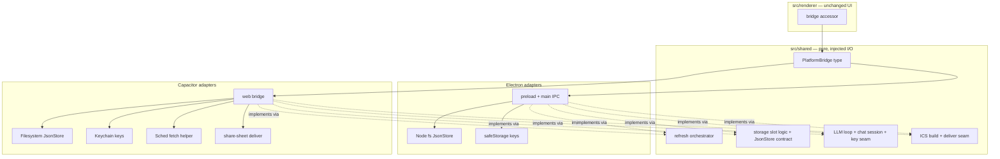
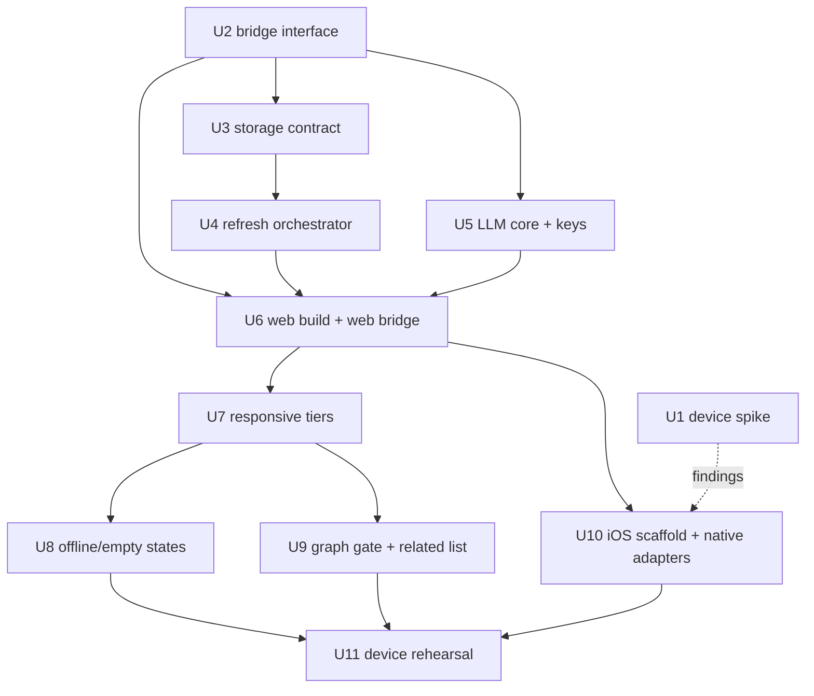

# feat: Capacitor iPad port

## Overview

Port Galileo to iPad by wrapping the existing renderer in a Capacitor 8 iOS shell. Same
repo, two build targets: the electron-vite build stays untouched, and a second plain-Vite
web build feeds the Capacitor WKWebView. The renderer's `window.api` dependency is
formalized into a platform-bridge interface with two implementations (Electron preload,
Capacitor/web), and platform-neutral logic currently in `src/main/` moves into
`src/shared/` under its existing purity rule. Full desktop parity in v1—browse, filter,
stars, viewport-gated graph, chat, ICS export—offline-first from cached snapshots, both
orientations, personal install but Store-ready.

---

## Problem Frame

Roger plans on the Mac at home and wants the schedule on an iPad at the con, over hotspot
or cached data. Electron is desktop-only. The requirements doc
(`docs/brainstorms/2026-07-22-capacitor-ipad-port-requirements.md`) settled the product
questions: full parity v1, no stars sync, chat included, graph gated by viewport width,
data posture preserved (each device fetches Sched itself; no hosted mirror), keys in
Keychain with a deliberately relaxed boundary, personal distribution designed not to
foreclose the App Store. This plan settles how.

---

## Requirements Trace

Origin requirements R1–R18 (see origin doc). Grouped by where this plan lands them:

- R1–R4 (repo, build targets, bridge, shared extraction) → U2–U7, U9
- R5 (one snapshot/drift implementation) → U3, U4
- R6 (device-side Sched fetch, data posture, bundled enrichment) → U4, U10
- R7–R9 (offline-first, staleness, fetch never corrupts) → U3, U4, U8, U11
- R10–R12 (parity, share-sheet ICS, chat with streaming) → U2, U5, U10
- R13–R15 (orientations, three-tier breakpoints, viewport-gated graph, touch/a11y) → U7, U8, U9
- R16 (Keychain, relaxed key boundary) → U5, U10
- R17–R18 (personal install, Store-ready, AGPL decision pre-Store) → U9; AGPL deferred per origin

**Origin flows:** F1 (con-floor offline browse), F2 (opportunistic refresh + drift), F3
(export to Calendar), F4 (chat on the go)
**Origin acceptance examples:** AE1 (offline launch, covers R7/R8), AE2 (rotation handoff,
covers R13/R14), AE3 (Electron unbroken, covers R2/R3), AE4 (no Galileo-hosted Sched data,
covers R6)

**Flow-analysis additions.** Pre-planning flow analysis surfaced gaps the origin doc
doesn't spell out; this plan adopts them as derived requirements rather than amending the
origin:

- D1. First launch with no snapshot and no network shows a designed empty state with a
  retry affordance (extends F1/AE1). → U8
- D2. The iOS storage backend reproduces the desktop store contract: atomic
  write-temp-then-rename, corrupt-reads-as-absent, single writer, echo-back on failed star
  writes. Stars and snapshots live in durable app-container storage, never bare IndexedDB
  (extends R7/R9). → U3, U10
- D3. Interrupted streaming chat keeps partial text, marks the turn interrupted, allows
  resend; the tool loop never leaves half-applied state (extends R12). → U5
- D4. Provider streaming has a decided degradation order, not a discovered gap (extends
  R12; see Key Technical Decisions). → U5, U10
- D5. The key store distinguishes three states—no key, key unreadable right now (Keychain
  locked/error), key present—so users are never told to re-enter a key they have (extends
  R16). → U5, U10
- D6. Refresh is single-flight; the gesture is disabled while a fetch is in flight
  (extends R9). → U4, U8
- D7. Rotation/Split View handoff preserves selected event uid and focused entity id;
  camera state is best-effort; the width gate has hysteresis so resize drags don't thrash
  (extends AE2). → U8, U9
- D8. Staleness shows the last-known-good `fetchedAt` as relative time, recomputed on app
  resume (extends R8). → U8
- D9. Chat transcript is session-only (desktop parity); filters and stars persist;
  scroll/selection restoration is best-effort (state-restoration decision). → U8
- D10. Dynamic Type posture is declared (v1: fixed CSS type ramp, recorded as an
  EXCEPTIONS.md entry); the related-panels list is the accessible expression of the graph
  at every width (extends R15). → U8, U9

---

## Scope Boundaries

Carried from origin: no stars sync, no phone-tier layout shipping (the tier system
anticipates it), no App Store submission, no hosted data infrastructure, no PWA
distribution (the web build is a dev/test surface only).

Plan-local:

- No EventKit calendar-write integration in v1 unless the U1 spike shows share-sheet .ics
  cannot reach Calendar at all (see Key Technical Decisions).
- No SQLite; data volume (hundreds of KB of JSON) doesn't warrant it.
- No Android scaffold in this plan; U2–U8 are deliberately Android-ready but `cap add
  android` is a follow-up.
- No snapshot schema-version bump ships during con week (migration discards unknown
  versions by design; an update + bump + offline con floor = silently empty app).

### Deferred to Follow-Up Work

- Android target (`cap add android`, Keystore adapter, Play listing): future phase per origin.
- Phone/compact-tier layout design: future phase per origin; the tier system lands here.
- AGPL App Store exception text: required before any Store submission (origin R18).
- App Store guideline 4.2 review-safe checklist: formal compliance research is a
  pre-submission item alongside the AGPL decision; v1 choices (offline-first, native
  integrations, durable storage) are deliberately compatible.

---

## Context & Research

### Relevant Code and Patterns

- `src/preload/index.ts`—the complete bridge surface: 13 request/response methods plus
  exactly one push channel (`llm.onChatDelta`). All payload types already live in
  `src/shared/`; the interface is nearly portable as-is.
- `src/main/index.ts` `refreshSchedule()`—the extraction target for U4; everything
  decision-shaped it calls (`buildDataset`, `resolveRefresh`, `migrateSnapshot`,
  `acknowledgeChanges`) is already in `src/shared/schedule/`.
- `src/main/snapshotStore.ts`, `src/main/starStore.ts`—identical atomic-write pattern
  (`${target}.${pid}.tmp` + rename; read: absent==corrupt==null). Stars tolerate unknown
  schema versions deliberately; snapshots discard them deliberately.
- `src/main/llm/loop.ts`, `tools.ts`, `providers.ts`, `models.ts`, `systemPrompt.ts`—zero
  node/electron imports today; `runChatTurn` already takes keyStore as a minimal interface.
- `src/main/llm/ipc.ts`—single-inflight AbortController with supersede semantics, 90s
  timeout, payload validation; platform-neutral logic to extract in U5.
- `src/main/icsExport.ts`—already split into neutral orchestration over injected
  `IcsExportDeps`; U2 generalizes the deps shape for the share sheet.
- `src/renderer/src/state/spine.tsx` and four other small null-safe `window.api`
  accessors (ChatKeySetup reaches the bridge via chatModels' helper)—the only bridge
  touchpoints; consolidation in U2 is mechanical.
- `src/renderer/src/views/graph/GraphView.tsx` `useSize` (callback ref + ResizeObserver)—
  ready-made width source for the U9 gate.
- DI-over-mocks testing convention throughout (`SafeStorage`, `LlmIpcHost`, `StarIpcMain`,
  `IcsExportDeps`, injected `GenerateFn`/`fetchImpl`)—every new seam follows it.

### Institutional Learnings

- `docs/solutions/2026-07-18-uid-is-the-identity-key.md`—`uid` keys stars, diffs,
  change log, graph nodes, ICS UIDs; Sched flags are static annotation; events vanish
  silently (ghost stars must survive the port).
- `docs/solutions/2026-07-19-memo-identity-is-the-graph-contract.md`—hook moves must
  preserve useMemo boundaries; `toBe` identity tests move with the hooks.
- `docs/solutions/2026-07-19-testing-a-canvas-view-in-jsdom.md`—stub-the-renderer
  convention; three mandatory stubs; description-hash fixture trap.
- `docs/solutions/2026-07-20-streamtext-text-is-the-final-step.md`—three AI SDK landmines
  the U5 relocation must not reintroduce; the parts/finalText-disagree fake is the test
  pattern that catches them.
- `docs/solutions/2026-07-20-theming-a-canvas-instrument.md`—palette invalidation is
  pushed, not polled; iOS adds appearance-change and resume triggers (U10).
- `docs/solutions/2026-07-21-portable-write-failure-injection.md`—failure injection keys
  off invariants of the storage code, never OS permission tricks; run the full suite on any
  new platform before shipping (U11).
- `docs/A11Y-DECISIONS.md`/`docs/EXCEPTIONS.md`—docked card is a non-modal aside (a sheet
  would be a new logged decision); the list is the AA path at every width; boot background
  needs a WKWebView equivalent to avoid a theme flash; sub-12px floors hold on iPad.

### External References

- Capacitor 8: Xcode 26+, iOS 15+, SPM default for new projects (CocoaPods fallback);
  `ios/` is committed source minus `ios/App/App/public/` and the generated
  `capacitor.config.json`.
- CapacitorHttp: fetch/XHR patch buffers responses (no streaming, no SSE) and is
  all-or-nothing—but the `CapacitorHttp.request()` helpers work with the patch disabled.
- Provider CORS posture: Anthropic explicitly supports browser-origin via
  `anthropic-dangerous-direct-browser-access`; OpenRouter explicitly supports browser
  calls; OpenAI is best-effort; Gemini-class endpoints blocked (n/a here).
- `@aparajita/capacitor-secure-storage` v8 (Keychain-backed, current, Cap 8 line).
- `@capacitor/filesystem`: `Directory.Data`≡Documents on iOS; no atomic-write option
  (manual temp+`rename()`); `Directory.Cache` is shareable and purgeable.
- Share sheet: `writeFile`→`getUri`→`Share.share({files})`; Calendar's direct .ics import
  from third-party apps is known-flaky (spike check in U1).
- iPad multitasking: supporting Split View requires all orientations and no
  `UIRequiresFullScreen`—both orientations are a platform constraint, not just a
  requirement.
- WKWebView canvas: rAF capped at 60Hz; content-process memory ceiling—use
  `cooldownTicks`, pause on `visibilitychange`, avoid per-frame allocation in painters.

---

## Key Technical Decisions

- **CapacitorHttp patch stays disabled; the helpers do the Sched fetch.** The global
  fetch patch would break chat streaming and is all-or-nothing. Instead the iOS fetch
  adapter calls `CapacitorHttp.request()` explicitly (CORS-free native networking, existing
  User-Agent), and the WebView's real `fetch` stays untouched for everything else.
- **Chat transport: streamed direct fetch first, buffered helper as fallback.** Anthropic
  and OpenRouter stream over plain fetch+SSE from the `capacitor://localhost` origin.
  OpenAI attempts the same; if CORS rejects it at runtime, the turn degrades to a
  non-streamed `CapacitorHttp.request()` call with a status message ("responses won't
  stream for this provider"). Parity (R12/D4) with a decided, tested degradation.
  Contingency if a provider breaks both paths: `capacitor-stream-http` community plugin.
- **Storage: Filesystem JSON behind a `JsonStore` contract—with iOS-honest replace
  semantics.** All artifacts (two snapshot slots, change log, stars, filters) live as JSON
  files in the iOS app container via `@capacitor/filesystem`. IndexedDB holds nothing
  authoritative. Verified: the plugin's `rename()` on iOS is delete-then-move (succeeds
  over existing files but is NOT atomic—there is a kill window where the target is absent
  and only the temp exists), and bare `writeFile` is non-atomic (truncate-write). The
  contract therefore does not claim atomic replace; it claims: a failed or interrupted
  replace never leaves the artifact corrupt AND the previous or new bytes are always
  recoverable. Mechanisms (all in shared code so both platforms inherit them): read-side
  temp recovery (target absent/corrupt + parseable temp → promote the temp), startup
  orphan-temp sweep (after recovery), per-name async write serialization, and a
  two-generation rotation for stars (see next decision). Escalation path if U1/U11
  observe real loss: a tiny native plugin method wrapping `FileManager.replaceItemAt`
  (journaled atomic replace)—deliberately not in v1 to keep the no-native-code posture.
- **Stars get a second generation.** Corrupt-reads-as-absent is fine for re-fetchable
  snapshots and the advisory change log, but for irrecoverable stars it is itself the loss
  mechanism: absent read → empty list → next star tap persists near-empty → permanent
  silent loss (echo-back would launder it). Star writes rotate primary→backup in shared
  slot logic; reads fall back to the newest parseable generation.
- **Keys: `@aparajita/capacitor-secure-storage`, `afterFirstUnlock` accessibility.** The
  key store seam reports three states (D5), with a stated per-platform mapping: iOS
  "unreadable" covers transient conditions (Keychain locked, plugin error); Electron's
  decrypt failure remains a permanent "no key" (a key sealed under a different OS
  credential—re-prompting is correct, preserving today's documented behavior), and the
  "unreadable never prompts re-entry" test is scoped to transient-capable adapters. A
  failed secure write surfaces the failure—plaintext or in-memory fallback is not
  acceptable, matching desktop. The origin's key-boundary relaxation stands; key values
  live in JS only at call time.
- **Bridge selection at runtime.** The bridge module prefers `window.api` when the
  preload injected it (Electron) and otherwise constructs the web/Capacitor
  implementation. No build-time forking; `Capacitor.isNativePlatform()` selects
  native-vs-browser adapters inside the web implementation.
- **Shared-purity ruling for the LLM core.** Moving the loop to `src/shared/` is
  compatible with the purity rule because network access is injected: providers are
  constructed with a supplied `fetch` (the AI SDK supports per-provider fetch), so shared
  code performs no ambient I/O. This ruling gets a code comment where the loop lands.
- **Breakpoint tiers (directional):** compact <700px, medium 700–999px, wide ≥1000px;
  the graph gate sits at the medium/wide boundary with ±40px hysteresis (D7). The wide
  floor deliberately sits below desktop's `minWidth: 1024` so every legal Electron window
  stays in the wide tier and AE3's pixel-identical promise holds. iPad landscape (~1180pt)
  gets the graph; portrait (~820pt) gets the related-panels list and clears the wide floor
  minus hysteresis by a wide margin (no jitter risk); exact values are tuned on device in
  U11.
- **Per-target CSP.** `src/renderer/index.html` ships `connect-src 'self'`, which would
  block the direct-fetch streaming path outright. The Electron build keeps it unchanged;
  the web/Capacitor build rewrites the CSP at build time (Vite HTML transform in
  `vite.config.web.ts`) to an explicit allowlist of the three provider origins—no blanket
  relaxation. `CapacitorHttp.request()` calls are native-bridge traffic and bypass page
  CSP (confirmed during U1), so the Sched fetch needs no CSP entry.
- **Calendar path: share sheet in v1.** The U1 spike verifies what Calendar actually does
  with a shared .ics (import, duplicate handling on re-export). If Calendar can't import at
  all, the EventKit plugin (`ebarooni/capacitor-calendar`) becomes a scoped follow-up
  decision—not silently added here.
- **SPM confirmed.** Capacitor 8 scaffolds SPM, and `@aparajita/capacitor-secure-storage`
  v8 ships a root `Package.swift` with an SPM demo—verified compatible. CocoaPods fallback
  remains available but is no longer expected.
- **Backup posture per artifact, expressed as directory placement.** The Filesystem
  plugin exposes no backup-exclusion-attribute API, so the posture is implemented by where
  files live: stars and filters in the backed-up app data directory (irrecoverable state
  rides iCloud backup and device migration); snapshot slots and the change log in
  `Directory.LibraryNoCloud` (re-fetchable, and it keeps Sched prose out of user backups,
  consistent with the data posture's spirit). The store adapter maps artifact name →
  directory, and each temp file lives beside its target so rename stays a same-volume
  move. Keychain `afterFirstUnlock` without ThisDeviceOnly means keys migrate through
  encrypted backups—desired (no "no key" surprise after restore) and now stated rather
  than defaulted.
- **Chat transcript is session-only (D9).** Matches desktop; persisting transcripts is a
  new product decision nobody made.

---

## Open Questions

### Resolved During Planning

- Streaming transport → resolved (see Key Technical Decisions; verified against current
  Capacitor 8 docs and provider CORS postures).
- Storage backend → resolved: Filesystem JSON behind the `JsonStore` contract; not
  IndexedDB, not Preferences, not SQLite.
- Keychain plugin → resolved: `@aparajita/capacitor-secure-storage`.
- Bridge selection → resolved: runtime, `window.api`-first.
- Web-build config → resolved: standalone `vite.config.web.ts` replicating the renderer
  section of `electron.vite.config.ts` (root, plugins, aliases, `index.html` only), its own
  `outDir` (`dist-web/`), Vite pinned `^7` respected.
- Breakpoint widths → directionally resolved (see decisions); final tuning on device.

### Deferred to Implementation

- Exact hysteresis and tier boundary values: need real Split View drag behavior on
  hardware (U11).
- Whether OpenAI's browser CORS works from the `capacitor://` origin this quarter: the
  code ships the decided fallback either way (U5/U10); the spike records the observed state.
- Calendar's .ics import and duplicate/update behavior on re-export: U1 spike question;
  determines whether the EventKit follow-up gets proposed.
- SPM resolution of the secure-storage plugin: discovered at `cap add ios` time; fallback
  decided above.
- Launch-screen background treatment (the boot-flash exception's WKWebView equivalent):
  needs the actual storyboard in hand (U9).

---

## High-Level Technical Design

> *This illustrates the intended approach and is directional guidance for review, not
> implementation specification. The implementing agent should treat it as context, not
> code to reproduce.*

One contract, three implementations, one shared core. Everything decision-shaped lives in
`src/shared/`; each platform contributes only I/O adapters:

The renderer never learns which platform it's on beyond the accessor's selection; the
shared core never performs ambient I/O (fetch, storage, and key access are all injected
through the seams U2–U5 define).

---

## Implementation Units

Dependency shape (U6 is the fan-in point; U1 informs but does not block U2–U5):

- U1. **Throwaway device spike**

**Goal:** Retire the four highest-uncertainty assumptions on real hardware before the port
depends on them.

**Requirements:** R6, R12, R14 risk retirement; origin key decision "early device spike";
Calendar question (F3).

**Dependencies:** None. Runs first; nothing merges from it.

**Files:**
- Create: nothing committed except `docs/solutions/` findings; the scaffold lives on a
  scratch branch and is discarded.

**Approach:**
- Minimal `cap init`/`cap add ios` against a hand-built renderer bundle (hacked bridge
  stubs are fine—this is not U10). Verify on Roger's iPad: (1) entity-map canvas frame
  feel at real node counts, rotation included; (2) `CapacitorHttp.request()` against the
  Sched site with the production User-Agent; (3) Anthropic SSE-over-fetch streaming from
  the `capacitor://localhost` origin; (4) share-sheet .ics → what Calendar actually offers,
  including a second export of the same UIDs.
- While instrumented, also observe what a mid-write kill actually leaves on disk through
  the Filesystem plugin (partially-written temp, mid-rename kill)—ground truth for U3's
  recovery rules.
- Record findings as a `docs/solutions/` entry (type: decision); note the observed OpenAI
  CORS state while set up.

**Test scenarios:**
- Test expectation: none—throwaway spike; its output is the findings doc, and the
  assumptions it retires are tested for real in U10/U11.

**Verification:**
- A findings doc exists answering all four questions with observed behavior, and the
  scaffold branch is deleted.

---

- U2. **Platform bridge interface and accessor consolidation**

**Goal:** Make the bridge a formal, platform-neutral contract instead of a
preload-implementation artifact, and give the renderer exactly one way to reach it.

**Requirements:** R3; R11 (deps seam); AE3; D9 (settings surface).

**Dependencies:** None.

**Files:**
- Create: `src/shared/bridge/types.ts` (the `PlatformBridge` interface: current 13 methods
  + `onChatDelta`, plus a small `settings.get/set` pair over the storage seam (D9); key
  status keeps today's boolean shape here—the three-state upgrade (D5) lands in U5
  alongside its producer), `src/renderer/src/bridge.ts`
  (single accessor: `window.api` if present, else the web bridge from U6; until U6 lands it
  degrades exactly as today's null-safe accessors do)
- Modify: `src/preload/index.ts` (implements the shared type), `src/renderer/src/state/spine.tsx`,
  `src/renderer/src/sidebar/ChatTab.tsx`, `src/renderer/src/sidebar/ChatKeySetup.tsx`,
  `src/renderer/src/sidebar/chatModels.ts`, `src/renderer/src/App.tsx`,
  `src/renderer/src/AboutApp.tsx` (consume the accessor), `src/main/icsExport.ts`
  (generalize `IcsExportDeps` to a single `deliver(defaultName, contents)` operation so the
  save-dialog two-step and the share sheet satisfy one shape)
- Test: existing renderer tests migrate from `window.api` pokes to a typed fake-bridge
  helper; `src/main/__tests__/icsExport.test.ts` updated for the deps shape.

**Approach:**
- Pure refactor: no behavior change on Electron. The fake-bridge test helper becomes the
  sanctioned way renderer tests stub the platform (replacing ad-hoc `(window as any).api`
  assignment).

**Patterns to follow:**
- Structural-interface injection per `CLAUDE.md` testing rules; existing `bridge()`
  null-guard behavior in `state/spine.tsx`.

**Test scenarios:**
- Happy path: fake bridge wired through the accessor drives spine refresh/stars and chat
  key status exactly as the current window-poke tests do (all existing suites stay green).
- Edge case: accessor with no bridge present degrades to today's "No Electron bridge"
  error strings (assert unchanged copy).
- Happy path: `exportIcs` with a `deliver`-shaped dep receives the built ICS text and
  default filename; cancelled delivery maps to the existing `cancelled` result.
- Error path: `deliver` throwing maps to the existing `failed` result with message.

**Verification:**
- `npm run typecheck` and `npm test` pass; the Electron app runs unchanged (AE3); no
  renderer file references `window.api` outside `src/renderer/src/bridge.ts`.

---

- U3. **Storage contract extraction**

**Goal:** One shared statement of the store contract—atomic replace,
corrupt-reads-as-absent, single writer, echo-back—with slot/normalization logic in shared
and only byte-level I/O per platform.

**Requirements:** R4, R5, R7, R9; D2.

**Dependencies:** U2 (lands the shared types location; mechanical).

**Files:**
- Create: `src/shared/storage/jsonStore.ts` (the `JsonStore` interface: `read(name)`,
  `replace(name, value)` with atomic semantics documented), `src/shared/storage/slots.ts`
  (snapshot-slot logic, change-log validation, star persistence with echo-back—moved from
  `src/main/snapshotStore.ts`/`starStore.ts`)
- Modify: `src/main/snapshotStore.ts`, `src/main/starStore.ts` (shrink to a Node
  `JsonStore` adapter: temp+rename, pid-based temp names)
- Test: `src/shared/storage/__tests__/slots.test.ts` (in-memory fake store),
  `src/main/__tests__/nodeJsonStore.test.ts` (real fs in mkdtemp dirs, carrying the
  portable write-failure injection from the existing star-store tests).

**Approach:**
- The `JsonStore` contract states what iOS can actually honor (see Key Technical
  Decisions): replace never corrupts, previous-or-new bytes always recoverable, per-name
  async write serialization (overlapping replaces on one name apply in order), read-side
  temp recovery, and the adapter invariant "a failed replace leaves the previous bytes
  readable"—stated in the contract and tested on both adapters, not assumed from Node.
- The stars echo-back contract (failed write returns the previously persisted list) moves
  into shared slot logic so both platforms inherit it, joined by the two-generation star
  rotation (write rotates primary→backup; read falls back to newest parseable
  generation); the write-failure injection keys off an invariant of each adapter, per the
  2026-07-21 learning.
- Snapshot schema discard vs. star schema tolerance both move as-is—these are deliberate
  asymmetries, not accidents.

**Patterns to follow:**
- `src/main/snapshotStore.ts` two-slot layout; `normalizeStars` tolerance comment in
  `src/main/starStore.ts:33`.

**Test scenarios:**
- Happy path: replace-then-read round-trips each artifact (both snapshot slots, change
  log, stars) through the in-memory fake.
- Edge case: corrupt JSON, absent file, and unknown snapshot schemaVersion all read as
  null/empty; unknown star schemaVersion still yields the stars (tolerance preserved).
- Error path: injected `replace` failure on stars returns the prior persisted list
  (echo-back), and the on-disk file is untouched (Node adapter test).
- Edge case: corrupt star primary + valid backup generation recovers the backup; both
  generations corrupt reads as empty (the floor, now two failures deep).
- Integration (D2): overlapping `replace` calls on one name serialize—final state is the
  last call's value, no interleaved partial state (async-fake adapter with controllable
  step timing).
- Integration: Node adapter's temp file is cleaned up after a failed rename; a successful
  replace leaves no temp file.

**Verification:**
- Existing snapshot/star behavior byte-identical on desktop (existing tests green against
  the refactor); shared slot tests run with no fs at all.

---

- U4. **Shared refresh orchestrator**

**Goal:** One implementation of fetch→guard→promote→log for both platforms, single-flight.

**Requirements:** R5, R6, R9; D6; F2.

**Dependencies:** U3.

**Files:**
- Create: `src/shared/schedule/refresh.ts` (`performRefresh({fetchSources, slots},
  {acceptAnyway})`—the logic currently inline in `src/main/index.ts:86`, plus
  single-flight: a second call while one is in flight returns the in-flight promise when
  options match; a call carrying `acceptAnyway` during a plain refresh queues behind it
  rather than having its option silently swallowed)
- Modify: `src/main/index.ts` (compose `performRefresh` from `fetchScheduleSources` + the
  Node store; `canonicalEvents` resolution moves alongside), `src/main/fetchExecutor.ts`
  (unchanged behavior; becomes the reference `fetchSources` implementation)
- Test: `src/shared/schedule/__tests__/refresh.test.ts`.

**Approach:**
- `fetchSources` is an injected async function returning the raw source payloads;
  everything after it is shared. Interrupted-fetch semantics: a rejected `fetchSources`
  falls through to `resolveRefresh` with `fetched: null` exactly as today—an abandoned
  fetch is restartable and never touches the slots (D2's ordering invariant holds because
  slot writes happen only after a complete fetch).
- **Prefix-consistency invariant, stated as law:** the commit sequence (write
  last-fetched → verdict → promote → write change log) is ordered by decreasing
  importance so that every truncation point is a consistent resting state—stop after step
  one and you have the inspectable rejected fetch; stop after promote and you have correct
  data with stale change badges. Promote is a *write into* last-known-good, never a rename
  of last-fetched (renaming would vacate the inspection slot). A future edit must not
  reorder this sequence.
- `fetchedAt` is stamped at fetch *resolution* time, not fetch start—a fetch that began
  pre-suspension and settles hours later on resume must not claim freshness it doesn't
  have (D8).

**Test scenarios:**
- Happy path: successful fetch writes last-fetched, promotes on ok verdict, returns fresh
  projection with diff entries.
- Happy path: drift verdict without acceptAnyway serves last-known-good with warning;
  with acceptAnyway promotes.
- Edge case (Covers AE1): fetch rejection with an existing baseline returns the stale
  projection, slots untouched.
- Edge case (Covers D1): fetch rejection with no baseline returns the empty projection
  (`fetchedAt` null).
- Edge case: captive-portal-style garbage payload (HTML where JSON expected) reads as a
  failed fetch—prior snapshot intact, not an empty schedule.
- Integration (D6): two concurrent `performRefresh` calls share one `fetchSources`
  invocation and resolve to the same projection.
- Integration (prefix consistency): a store fake that halts after each write step yields
  a readable, consistent state at every truncation point—rejected-fetch inspectable after
  step one; promoted data with recomputable badges after step three.

**Verification:**
- Desktop refresh flow unchanged end-to-end (drift warning, acknowledgment, ghost stars);
  `src/main/index.ts` no longer contains refresh decision logic.

---

- U5. **LLM core relocation and chat session extraction**

**Goal:** The chat loop, tools, providers, models, and session management live in
`src/shared/` with injected fetch and key access; Electron IPC becomes a thin host.

**Requirements:** R4, R12, R16; D3, D4, D5; F4.

**Dependencies:** U2.

**Files:**
- Create: `src/shared/llm/` (moved `loop.ts`, `tools.ts`, `providers.ts`, `models.ts`,
  `systemPrompt.ts`; providers constructed with an injected `fetch`),
  `src/shared/llm/session.ts` (extracted from `src/main/llm/ipc.ts`: payload validation,
  single-inflight AbortController with supersede, 90s timeout, delta callback registry),
  `src/shared/llm/keys.ts` (the `{status, get, set, clear}` seam with D5's three-state
  status; platform-neutral base64 instead of node `Buffer`)
- Modify: `src/main/llm/ipc.ts` (shrinks to channel registration + `sender.send`
  plumbing), `src/main/llm/keyStore.ts` (Node/safeStorage adapter of the shared seam),
  `package.json` (the `test:live` script path follows the relocated `live.eval.test.ts`)
- Test: moves with the code—`src/shared/llm/__tests__/` including `loop.stream.test.ts`'s
  parts/finalText-disagree fake, plus new session tests.

**Approach:**
- The three streamText landmines travel with their tests: fullStream text accumulation,
  abort-checked-on-resolve (aborted is a third outcome; no success-path side effects after
  abort), empty-reply summarizer passing `tools` with `toolChoice: 'none'`.
- D3 lands here: an interrupted stream resolves the turn with accumulated partial text
  and an interrupted marker; tool results are committed only on completed steps.
- D4's degradation order is a session-level concern: the transport is injected as
  `{streamFetch, bufferedRequest}` and the session decides per-provider; U10 supplies the
  Capacitor implementations. The live model-catalogue fetch rides the same injected
  transport (buffered is fine—it isn't streamed), so a CORS-blocked provider degrades the
  same way in chat and in the model picker, and the Anthropic listing request carries the
  same browser-access header as the chat transport.

**Execution note:** Move-then-verify: relocate modules with tests green before extracting
the session, so landmine regressions are attributable.

**Patterns to follow:**
- `src/main/llm/ipc.ts` supersede/timeout logic; `keyStore` structural-interface
  pattern; the shared-purity ruling comment lands on `src/shared/llm/providers.ts`.

**Test scenarios:**
- Happy path: multi-step tool turn returns accumulated prose from all steps (the
  disagree-fake asserts accumulation wins over final-step text).
- Error path: abort after a completed step resolves as aborted—no filter patch commits,
  no delta after abort.
- Error path (D3): stream error mid-turn yields partial text + interrupted status;
  resend works cleanly.
- Edge case (D5): key status distinguishes absent vs unreadable vs present; unreadable
  never prompts key deletion.
- Integration (D4): a provider whose streamFetch rejects with a CORS-shaped error retries
  once via bufferedRequest and emits the non-streaming status delta.
- Error path (D4): `models()` under a CORS-rejecting fetch falls back to bufferedRequest;
  if both fail it returns an empty list and the picker's curated defaults still render.
- Happy path: web tsconfig type-checks the moved modules (no node typings leak—`Buffer`
  gone).

**Verification:**
- Desktop chat behaves identically (streaming, cancel, supersede, key management);
  `src/main/llm/` contains only Electron adapters; `npm run test:live` still gates and
  passes when deliberately run.

---

- U6. **Web build target and web bridge implementation**

**Goal:** The whole app runs in a desktop browser from a plain Vite build—the permanent
second test surface and the bundle Capacitor will wrap.

**Requirements:** R2, R3; AE3, AE4.

**Dependencies:** U2, U4, U5.

**Files:**
- Create: `vite.config.web.ts` (renderer root, react + tailwind plugins,
  `@renderer`/`@shared`/`@data` aliases, `index.html` entry only, `outDir: 'dist-web'`),
  `src/renderer/src/bridge/web.ts` (implements `PlatformBridge`: in-browser `JsonStore`
  (memory or localStorage—dev surface only, not durable by design), plain-fetch
  `fetchSources` (works only where CORS allows; the dev surface accepts this), shared LLM
  session with browser fetch, `deliver` via Blob download)
- Modify: `src/renderer/src/bridge.ts` (wire web bridge as the no-`window.api` path),
  `package.json` (`build:web`, `dev:web` scripts), `vitest.config.ts` (glob covers any new
  dirs), `tsconfig.web.json` (includes the new files)
- Test: `src/renderer/src/bridge/__tests__/web.test.ts`.

**Approach:**
- The web bridge is the Capacitor bridge minus native adapters: U10 swaps `JsonStore`,
  fetch, keys, and deliver implementations behind the same class. No Sched proxy is added
  for the dev surface—data posture (AE4) outweighs dev convenience; dev works from fixtures
  or an already-cached store.
- About window: the web/iPad build folds version display into the app (no second
  BrowserWindow); `about.html` remains Electron-only.

**Test scenarios:**
- Happy path: full renderer boots against the web bridge in jsdom—schedule renders from a
  fixture snapshot, stars persist through the in-browser store, echo-back holds.
- Happy path: chat key setup against the web bridge stores and reports status (fake
  secure store).
- Edge case: `deliver` produces a Blob with the ICS payload and suggested filename.
- Integration (Covers AE3): `npm run build` (electron-vite) and `npm run build:web`
  both succeed from one checkout; Electron output unaffected.

**Verification:**
- `npm run dev:web` serves the app in Safari/Chrome with browse/filter/star/graph/chat-UI
  working from fixture data; `dist-web/` contains no Sched prose (AE4—enrichment only).

---

- U7. **Responsive tier system**

**Goal:** The three-tier breakpoint system (compact/medium/wide) as real layout
infrastructure, replacing the fixed 1024×640 desktop assumption.

**Requirements:** R13, R15; AE2 groundwork.

**Dependencies:** U6 (developed against the web build).

**Files:**
- Create: `src/renderer/src/state/useViewportTier.ts` (matchMedia-driven tier with
  hysteresis at boundaries)
- Modify: `src/renderer/src/App.tsx` (tier-aware shell: persistent sidebar in wide;
  collapsible/overlay sidebar in medium; compact reserves a stub layout for the phone
  phase), `src/renderer/src/styles/` (safe-area insets via `env(safe-area-inset-*)`,
  `viewport-fit=cover` in `src/renderer/index.html`, touch target sizing per the new
  floor entries below), `docs/A11Y-DECISIONS.md` (two new logged decisions, see Approach)
- Test: `src/renderer/src/state/__tests__/useViewportTier.test.tsx`,
  App-level tier tests (jsdom with patched dimensions per the existing giveTheDomASize
  approach).

**Approach:**
- Tiers are a spine-adjacent input, not scattered media queries: components read the tier,
  CSS handles only cosmetics. Directional boundaries per Key Technical Decisions; a single
  constant module so U11 tuning is one edit.
- Two new `docs/A11Y-DECISIONS.md` entries land with this unit, so the floors citation
  points at something real: (1) a touch-target floor—44×44pt for primary touch targets
  per Apple HIG, with WCAG 2.5.8's 24px as the hard minimum for dense secondary controls
  (filter chips, star buttons), met by expanded hit areas (padding or pseudo-element),
  not visual growth; (2) the overlay sidebar's interaction contract—scrim tap and Escape
  both dismiss, focus moves into the panel on open and returns to the invoker on close,
  and the Chat/Filter tabs stay mounted while hidden (matching today's wide-tier
  behavior) so a chat transcript survives collapse/expand and tier crossings.
- The titlebar becomes platform-aware: the macOS traffic-light inset (`pl-20`) and the
  drag-region classes apply only under the Electron bridge; the iPad/web title row
  reclaims that space.
- EventCard stays a non-modal aside at wide/medium per the logged a11y decision; if the
  compact phase later wants a sheet, that's a new A11Y-DECISIONS entry, deliberately out of
  scope here.

**Test scenarios:**
- Happy path: tier hook reports wide/medium/compact at representative widths (1180, 820,
  590).
- Edge case (D7): width oscillating within the hysteresis band (e.g., ±30px against the
  ±40px band) does not flip the tier; crossing beyond the band does.
- Happy path: medium tier renders the collapsed-sidebar shell; wide renders today's
  layout unchanged.
- Integration: rotation simulation (resize 1180→820) preserves spine state—selected uid,
  filters, scroll anchor via the existing `useUidAnchor`.

**Verification:**
- Desktop Electron at ≥1024px renders pixel-identical to today (wide tier is the existing
  layout); the web build is usable at 820px width in a browser window.

---

- U8. **Offline, empty, and state-restoration UX**

**Goal:** The con-floor states are designed, not incidental: first-run empty, stale,
refreshing, interrupted, restored-after-termination.

**Requirements:** R7, R8; D1, D6, D8, D9; F1, AE1.

**Dependencies:** U7.

**Files:**
- Modify: `src/renderer/src/views/schedule/StaleBanner.tsx` (resume-recomputed relative
  staleness per D8), `src/renderer/src/views/schedule/ScheduleView.tsx` +
  `src/renderer/src/App.tsx` (first-run empty state with retry affordance per D1;
  refresh affordance disabled while in flight per D6), `src/renderer/src/state/spine.tsx`
  (persist active filters through the bridge store; chat transcript explicitly
  session-only per D9), `src/preload/index.ts` + `src/main/index.ts` (the Electron side
  of the U2 `settings.get/set` surface: one channel over the Node JsonStore—without it,
  desktop cannot honor D9's filter persistence), `src/renderer/src/state/theme.ts` +
  `src/renderer/src/sidebar/chatModels.ts` (theme and per-provider model choice migrate
  from localStorage into the settings artifact—WKWebView website data is evictable
  independently of the app container)
- Test: extend `StaleBanner` and spine tests; App-level first-run test; settings
  round-trip through the Electron channel.

**Approach:**
- Visibility/resume events recompute `fetchedAgo` (the WebView freezes timers while
  suspended—stale labels must not resume showing "2 minutes ago" after a night asleep).
- Filter persistence reuses the `JsonStore` seam (small settings artifact), keeping
  Preferences-vs-Filesystem a U10 adapter detail.

**Test scenarios:**
- Happy path (Covers AE1, D1): empty projection + no network renders the designed
  first-run state with retry; retry triggers one refresh.
- Happy path (D8): fetchedAt from yesterday renders a day-scale relative label; a
  simulated resume event recomputes it.
- Edge case (D6): refresh control disabled during in-flight refresh; re-enabled on
  settle either way.
- Happy path (D9): filters round-trip the bridge store; a fresh spine mount restores
  them; chat transcript does not survive a remount.

**Verification:**
- Killing and relaunching the web-build app restores filters and stars, shows honest
  staleness, and never shows a blank undesigned screen.

---

- U9. **Viewport-gated graph and related-panels list**

**Goal:** The graph appears where it has room; the same relatedness data reads as a list
where it doesn't; the swap preserves the user's place; touch works.

**Requirements:** R14, R15; D7, D10; AE2.

**Dependencies:** U7.

**Files:**
- Create: `src/renderer/src/views/related/RelatedPanel.tsx` (list expression of the
  entity-map neighbourhood for the selected event/entity)
- Modify: `src/renderer/src/App.tsx` (view routing: wide tier offers schedule/graph
  toggle as today; medium/compact replace graph with the related list),
  `src/renderer/src/views/graph/GraphView.tsx` (touch interaction: tap-to-pin replaces
  hover-preview; existing `useSize` feeds the gate; `cooldownTicks` + `visibilitychange`
  pause per WKWebView guidance)
- Test: `src/renderer/src/views/related/__tests__/RelatedPanel.test.tsx`, GraphView
  touch/gate tests under the canvas-stub convention.

**Approach:**
- `RelatedPanel` consumes `useEntityMap`'s existing derived data—no new graph math; memo
  identity contracts (`toBe` tests) move untouched with any hook adjustments. With no
  selection (first launch at medium/compact, or selection cleared), it renders a designed
  empty state—a prompt plus entry points (e.g., the map's top hubs)—never a blank panel,
  mirroring D1's treatment of the schedule surface.
- Selection contract (D7): selected event uid + focused entity id live in the spine and
  survive the swap both directions. Camera restoration is approximate, honoring AE2's
  "without losing the user's place": returning to the graph re-centers on the focused
  entity at the prior zoom level; exact pan state is not preserved.
- The view toggle stays truthful: at medium/compact its graph position is labeled (and
  accessibly named) for the related list—working label "Related," final copy Roger's
  call at implementation—so the control never claims a network view it isn't showing.
- A11y (D10): the related list is the graph's accessible expression at every width; the
  5-Day list remains the AA path to every event (logged mitigation holds); focus moves to
  the related panel's heading on a gate-driven swap.

**Patterns to follow:**
- Canvas testing per `docs/solutions/2026-07-19-testing-a-canvas-view-in-jsdom.md` (all
  three stubs, hash-consistent fixture); `docs/solutions/2026-07-19-memo-identity-is-the-graph-contract.md`.

**Test scenarios:**
- Happy path (Covers AE2, D7): with an entity focused in the graph at wide, narrowing to
  medium renders RelatedPanel for the same entity; widening restores the graph with the
  node still focused (asserted via props on the stub, not pixels).
- Happy path: tap on a stubbed node pins it (touch path); second tap dismisses.
- Happy path: no-selection RelatedPanel renders the designed empty state with focusable
  entry points, not a blank region.
- Happy path: the toggle's label and accessible name reflect the related list at medium
  tier and the graph at wide.
- Edge case: gate boundary oscillation does not remount the graph (hysteresis at the
  view level—no simulation restart, asserting stable element identity).
- Happy path (D10): focus lands on the related panel heading after a gate swap;
  every entity in the panel is reachable by keyboard.
- Integration: memo identity `toBe` assertions stay green through the routing change.

**Verification:**
- In the web build: dragging the window across the gate swaps views without losing
  selection or resetting the force layout; VoiceOver-style traversal of RelatedPanel reads
  coherently (manual check noted for U11 on device).

---

- U10. **Capacitor iOS scaffold and native adapters**

**Goal:** The committed iOS project, and the four native adapter implementations that turn
the web bridge into the iPad app.

**Requirements:** R1, R6, R10–R12, R16, R17; D2, D4, D5; F2–F4.

**Dependencies:** U6 (wraps its build); U1 findings inform choices.

**Files:**
- Create: `capacitor.config.ts` (appId `digital.wong.galileo`, `webDir: 'dist-web'`,
  CapacitorHttp NOT enabled), `ios/` (committed, minus `ios/App/App/public/` and generated
  config per gitignore), `src/renderer/src/bridge/capacitor/` (four adapters:
  `filesystemStore.ts` (JsonStore via write-temp+`Filesystem.rename`, app-container
  directory), `schedFetch.ts` (`CapacitorHttp.request` with production User-Agent + 15s
  timeout parity), `secureKeys.ts` (`@aparajita/capacitor-secure-storage`,
  `afterFirstUnlock`, three-state status per D5), `shareDeliver.ts` (Cache-dir write →
  `getUri` → `Share.share({files})`, temp cleanup, cancel = existing `cancelled` result))
- Modify: `.gitignore` (ios exclusions), `package.json` (`ios:sync`, `ios:open` scripts;
  Capacitor deps), `src/renderer/src/bridge.ts` (`isNativePlatform()` selects native
  adapters), Info.plist via the generated project (all four `~ipad` orientations, no
  `UIRequiresFullScreen`), theme boot background on the WKWebView/launch storyboard (the
  boot-flash exception's iOS instance), palette invalidation on appearance change + resume
  (per the canvas theming learning)
- Test: `src/renderer/src/bridge/capacitor/__tests__/` with plugin fakes (structural
  interfaces over the plugin APIs—same DI convention; no Capacitor module mocks).

**Approach:**
- Adapters implement the exact seams U2–U5 defined; nothing above the bridge changes.
- `filesystemStore` implements the honest replace protocol from Key Technical Decisions:
  temp write → delete-then-move, with init running temp recovery first, then the
  orphan-temp sweep; directory creation is idempotent (tolerates already-exists on every
  launch). Backup-exclusion attributes set per the recorded backup posture (snapshots and
  change log excluded; stars and filters included).
- The plugin fakes model the real two-step delete-then-move—a POSIX-shaped fake would
  validate a contract iOS doesn't provide, hiding exactly the kill-window bugs U3's
  contract exists to catch.
- Key entry UX: paste-friendly field, provider + set-status display (never the key);
  Universal Clipboard exposure noted in the key setup copy (flow-analysis item 11,
  accepted).
- Icons/splash via `@capacitor/assets` from a 1024px icon source.

**Test scenarios:**
- Happy path (D2): filesystemStore replace writes temp, deletes destination, then moves
  (asserted on the fake's call order); corrupt read returns null.
- Error path (D2): kill simulated between delete and move (fake halts mid-sequence) →
  target absent, temp present → next read recovers the temp's contents; a failure before
  the delete leaves prior bytes readable (the stated adapter invariant).
- Edge case: init sweeps orphan temps only after the recovery pass; a parseable orphan
  belonging to an absent target is promoted, not swept.
- Happy path: schedFetch maps `CapacitorHttp.request` responses to the `fetchSources`
  payload shape; non-2xx and garbage bodies reject (captive-portal case rides U4's
  pipeline).
- Edge case (D5): secureKeys maps plugin lock/error to "unreadable," absence to "no
  key"—distinct statuses through to the bridge.
- Happy path: shareDeliver passes a file URI to Share and cleans up the temp file after
  share resolves or cancels; cancel maps to `cancelled`.
- Integration (D4): session with Capacitor transports streams Anthropic (SSE fake) and
  falls back to bufferedRequest on a CORS-rejecting provider fake.
- Test expectation for `ios/` project files: none—Xcode project configuration is
  verified by U11's device rehearsal, not unit tests.

**Verification:**
- `npm run ios:sync && npx cap open ios` builds and runs on the simulator with live data
  fetch, stars persisting across relaunch, key stored in Keychain, share sheet presenting;
  repo diff shows no Sched prose committed (AE4).

---

- U11. **Device rehearsal and tuning**

**Goal:** The full-suite-on-new-platform rule applied to iPadOS: verify on hardware what
the port has only proven in simulators and jsdom, and tune what needed hardware to tune.

**Requirements:** R7–R9, R13–R15; AE1, AE2; D7, D8; origin success criteria.

**Dependencies:** U8, U9, U10.

**Files:**
- Modify: breakpoint/hysteresis constants from U7; any canvas performance settings from
  U9; `docs/solutions/` entry recording the rehearsal findings.

**Approach:**
- Structured manual rehearsal on Roger's iPad, in both orientations and Split View:
  offline cold launch (AE1), airplane-mode refresh failure, mid-fetch backgrounding, drift
  warning, rotation during graph interaction (AE2), share-to-Calendar (per U1 findings),
  chat streaming + interruption + cancel on the floor-realistic network, key entry from a
  password manager, VoiceOver pass over list/related/chat, Dynamic Type check against the
  declared posture (D10), ICS TZID rendering con-local in Calendar regardless of device
  time zone.
- Full `npm test` + `npm run typecheck` + a simulator run per release-rehearsal
  convention (portable-write-failure learning's process rule).

**Test scenarios:**
- Test expectation: none—this unit executes the manual checklist above and tunes
  constants; automated coverage landed in U3–U10.

**Verification:**
- Every checklist item observed and recorded; tuned constants committed; open findings
  filed as issues or `docs/solutions/` entries rather than left in memory.

---

## System-Wide Impact

- **Interaction graph:** the bridge accessor touches every renderer feature; U2's
  consolidation is the single choke point. The spine gains two inputs (viewport tier,
  filter persistence)—both flow through existing context; persistence reuses the
  JsonStore seam via the new `settings` bridge surface (one small artifact, no new store
  abstractions).
- **Error propagation:** fetch failures must keep resolving to projections (never
  throwing into the renderer), preserved by U4's single implementation; chat transport
  failures resolve to session outcomes (aborted/interrupted/degraded), never unhandled
  rejections in the WebView.
- **State lifecycle risks:** iOS suspension can freeze JS at any await; the storage
  contract (temp-recovery, prefix-consistent commit ordering, per-name serialization,
  star generations) is the defense, and it lives in one place (U3/U4). U4's
  commit-ordering (prefix-consistency) invariant is load-bearing here: the refresh
  sequence writes in decreasing order of importance so every truncation point is a
  consistent resting state, and a future edit must not reorder it. Two lifecycle
  events the desktop never sees: WKWebView content-process termination reloads the page
  into a *new* JS context while a native filesystem call issued by the old context may
  still land afterward, and all in-memory single-flight state is lost on reload—treat
  reload as kill+relaunch mid-commit, which the prefix-consistency invariant already
  covers. Palette caches invalidate on appearance change and resume (U10).
- **API surface parity:** `PlatformBridge` is now the contract three implementations
  share (preload, web, Capacitor); a method added to one must be added to the type first—
  the type lives in `src/shared/bridge/types.ts` precisely so the compiler enforces parity.
- **Integration coverage:** the parts/finalText-disagree fake (U5), the two-build check
  (U6/AE3), the gate-swap selection test (U9), and the D4 degradation test (U10) are the
  cross-layer scenarios unit tests alone would miss.
- **Unchanged invariants:** `uid` remains the identity key everywhere (no mobile-side
  re-keying); Sched flags remain untrusted; ghost stars survive; the 5-Day list remains
  the AA path at every tier; `src/shared/` purity holds (network injected, no node
  globals); the data posture holds (no Sched prose in the repo, the bundle pipeline, or
  any Galileo-operated host); desktop userData layout and package name untouched (no
  orphaned desktop stores).

---

## Risks & Dependencies

| Risk | Likelihood | Impact | Mitigation |
|------|-----------|--------|------------|
| Entity-map canvas performs poorly in WKWebView | Low-Med | Med | U1 spike first; cooldown/pause settings in U9; related-list is the fallback expression at more widths |
| OpenAI browser CORS blocked from capacitor:// origin | Med | Low | Decided degradation (D4): buffered non-streaming fallback; OpenRouter covers multi-model streaming |
| Calendar won't import shared .ics | Med | Med | U1 spike measures reality; EventKit plugin is a scoped follow-up decision, not a silent add |
| iOS kill/reload during a storage replace or refresh commit | Med | High | Verified non-atomic rename handled by design: temp recovery, orphan sweep, prefix-consistent commit order, per-name serialization, star generations (U3/U4/U10); native `replaceItemAt` plugin is the decided escalation; rehearsed in U11 |
| Star loss via corrupt-reads-as-absent + echo-back | Low | High | Two-generation rotation in shared slot logic; failed-replace invariant tested on both adapters (U3) |
| App update with a snapshot schema bump lands during con week | Low | High | Release constraint (Scope Boundaries): no schema-discarding migration ships during con week; U11 rehearsal includes an update-then-offline check |
| Vite web config drifts from electron-vite renderer config | Med | Low | Shared alias/plugin constants where practical; AE3 two-build check in CI habit |
| Sched blocks or rate-limits native-origin fetches | Low | Med | Same User-Agent and cadence as desktop; U1 spike verifies; offline-first means a block degrades, not breaks |
| Apple Developer membership not yet held | High (assumed absent) | Low | Needed before U1 device work; free-profile 7-day installs suffice for the spike itself |

---

## Documentation / Operational Notes

- `CLAUDE.md` needs updating in this work: the Architecture section (bridge layer, shared
  additions), the key-boundary sentence (now "Keychain at rest, JS at call time" on
  mobile), and new commands (`build:web`, `ios:sync`). The data-posture section gains one
  line: the mobile bundle ships enrichment only, never `events.json`.
- New `docs/solutions/` entries expected from U1 (spike findings) and U11 (rehearsal);
  the shared-purity ruling for injected fetch is worth its own decision entry.
- Release rehearsal convention extends to iOS: full suite + device checklist before any
  distributed build (already the plan's U11; keep it for future releases).

---

## Sources & References

- **Origin document:** docs/brainstorms/2026-07-22-capacitor-ipad-port-requirements.md
- Institutional learnings: docs/solutions/ entries cited in Context & Research
- Capacitor 8 docs (capacitorjs.com): config, ios, http, filesystem, share,
  screen-orientation, live-reload guides
- Provider CORS: Anthropic `anthropic-dangerous-direct-browser-access`; OpenRouter
  browser support; OpenAI best-effort
- Plugins: @aparajita/capacitor-secure-storage v8; @capacitor/filesystem, share,
  preferences, assets; contingency: chatboxai/capacitor-stream-http,
  ebarooni/capacitor-calendar
