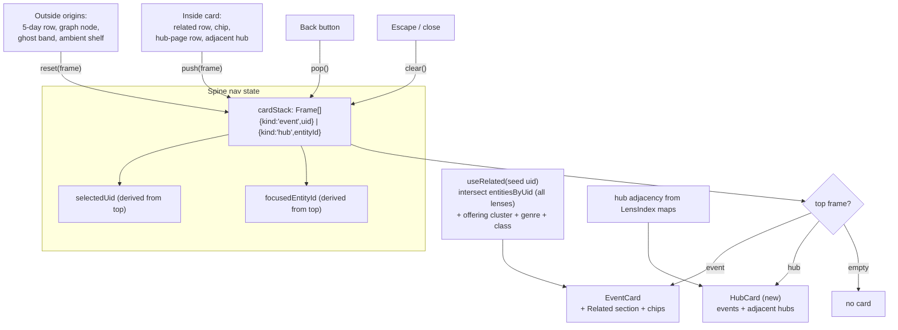

# feat: Affinity explorer — related rail, hub pages, card back stack

## Overview

Turn "I loved this panel, what else is like it?" into a first-class browsing experience:
event detail cards gain a ranked Related section with tappable person/franchise chips, hubs
become real pages (events + adjacent hubs), and event ⇄ hub navigation runs on a single
back stack in the spine that structurally cannot trap the user. At narrow widths a Browse
view replaces the Related tab; wide screens keep the node graph. Two iPad touch-target
fixes ship alongside.

---

## Problem Frame

Onsite iPad use exposed the Related view as a half-baked graph fallback: drilling
event → hub → event loops with no exit — the trap required a force quit. The mechanism:
RelatedPanel's focused-hub branch offers no escape affordance (no back, no clear), and the
one-slot selection model lets its two states overwrite each other with no history. GraphView's
stale-focus clearing effect runs only while the graph branch is mounted (it stays hidden-mounted
at narrow tiers while view is 'graph', but unmounts when the user switches to the 5-Day view)
and only clears out-of-scope hubs once the index is ready — none of which gives the user a
path out. Even with an escape bolted on, a flat hub list doesn't serve affinity browsing. Detail-card
event rows and the close/star pair are also too tight for touch. See origin:
`docs/brainstorms/2026-08-03-affinity-explorer-requirements.md`.

---

## Requirements Trace

- R1. Event cards gain a Related section (ranked related events + person/franchise chips)
- R2. Hub pages: the hub's events plus adjacent hubs
- R3. Event ⇄ hub navigation is one stack; hub → event tap shows the event (the loop case)
- R4. Back always retraces the path; dismissal returns to the originating view
- R5. Drill state never traps; leaving and re-entering yields a usable state
- R6. Narrow widths: Browse view replaces the Related tab (top franchises/people, filter/lens-scoped)
- R7. Card Related section and hub pages are universal; only the destination differs by width; chips push hub pages on all widths
- R8. Ranking draws on people, franchises, event classes, offering clusters, facets
- R9. Every related event states why it's related
- R10. Detail-card event rows meet comfortable touch sizing
- R11. Close/star (and now Back) controls separated for thumbs

**Origin flows:** F1 (rabbit hole from a loved event), F2 (cold-start Browse at narrow widths), F3 (escape hatch)
**Origin acceptance examples:** AE1 (hub → event shows event, Back retraces; covers R3, R4), AE2 (no re-trap after view switch; covers R5), AE3 (why-related names the person; covers R9)

---

## Scope Boundaries

- The node graph stays the wide-screen destination; not under evaluation for retirement (origin).
- No deck/affinity-triage interaction (origin: deferred).
- No new enrichment compile step; ranking uses committed/runtime signals only (origin).
- No scheduling intelligence (origin).
- No back-stack persistence across app restarts: spine state is session-only by design, a webview kill resets the stack, which satisfies R5 trivially. Decided, not deferred — do not add restore later without revisiting the trap analysis.
- `EntityCard` is retired, not fixed: the hub page card supersedes it in GraphView (its density problem disappears with it).
- This plan deliberately **un-defers** the EventRow/AmbientShelf nested-control VoiceOver fix that was shelved by product choice in `docs/TODO.md` (see `docs/solutions/2026-07-22-ipad-release-rehearsal.md`): U3 is already touching adjacent touch-target code, and shipping the explorer without it would add new VoiceOver-correct surfaces beside known-broken ones. The origin scopes R10/R11 to the detail card; the schedule-list fix rides along as an explicit scope addition, with its regression risk carried in the Risks table.

---

## Context & Research

### Relevant Code and Patterns

- `src/renderer/src/state/spine.tsx:139-146` — the mutual-exclusion setters (`setSelectedUid` / `setFocusedEntityId`); the exact seam the stack replaces. Spine invariant: inputs only, session-only nav state.
- `src/renderer/src/components/EventCard.tsx` — `CardShell` (shared docked `<aside>`, non-modal, Escape-closes), `useOfferingIndex` WeakMap pattern, ghost/orphan uid handling, static PEOPLE/FRANCHISES sections to convert to chips.
- `src/renderer/src/components/CardPresence.tsx` — mount/unmount choreography; content swaps while open render with no re-wipe (what frame navigation will look like).
- `src/renderer/src/state/useEntityMap.ts` — identity-stable model (`toBe`-asserted); `indexes: Map<LensId, LensIndex>` prebuilt for ALL lenses per dataset.
- `src/shared/graph/lensIndex.ts` — `entitiesByUid`/`uidsByEntity` both directions; intersection = relatedness score + why. `bipartite.ts` deliberately never materializes event-event edges (quadratic); the ranker must score per-seed, not globally.
- `src/shared/enrichment/offerings.ts` — offering clusters (`alternativeSessions`); `facets.ts` + `useSchedule.facetsByUid`/`classes` — corpus-wide, already memoized.
- `src/renderer/src/views/related/RelatedPanel.tsx` — to be replaced; its `min-h-11` button pattern and empty-state copy carry forward.
- `src/renderer/src/state/useViewportTier.ts` — the only legal width source (`compact|medium|wide`, hysteresis, zoom-normalized).
- `src/renderer/src/App.tsx:380-495` — view switching is spine state, no router; `crossedIntoRelated` heading-focus logic; ViewToggle relabeling at narrow tiers.
- `src/renderer/src/styles/observatory.css:221-247` — touch sizing system: `data-touch-layout` blanket 44px rule, `touch-hit-24` opt-down, explicit `min-h-11` for primary controls.
- `src/renderer/src/views/graph/LensSelector.tsx:23` — `LENS_LABEL`/`LENS_HINT` (ready-made why-copy); currently graph-view-owned, needs a neutral home.

### Institutional Learnings

- `docs/solutions/2026-07-18-uid-is-the-identity-key.md` — frames key on uid/entity id; stored uids must tolerate non-resolution (ghost pattern).
- `docs/solutions/2026-07-19-memo-identity-is-the-graph-contract.md` — new derivations identity-stable with honest deps, asserted `toBe`; explorer nav is exactly the unrelated-state-change that historically reset the force layout.
- `docs/solutions/2026-07-22-virtualizer-rendered-is-not-visible.md` — if Browse virtualizes: first-visible skips `end <= scrollOffset`; honest fakes model overscan.
- `docs/solutions/2026-07-19-testing-a-canvas-view-in-jsdom.md` — graph-adjacent tests: ResizeObserver stub, one-button-per-node force-graph stub, enrichment fixture hash discipline, identify cards by close control not title.
- `docs/solutions/2026-07-22-ipad-release-rehearsal.md` — consume `useViewportTier`, never raw geometry; known VoiceOver defect: parent `role="button"` wrapping a real star button flattens the control tree — fix, don't propagate.
- `docs/solutions/2026-07-22-ipad-device-spike.md` — full-corpus scale is hardware-verified smooth in WKWebView; no perf gate needed.
- `docs/A11Y-DECISIONS.md` — touch-target-floor (≥44×44 primary, ≥24×24 dense-repeated), docked-card (non-modal, replacement not stacked modals, Escape closes, no focus return), related-list (heading focus at width gate), graph-canvas (list route always exists), inline-event-link, live-regions, lint-gate.
- `CONCEPTS.md` — defines Viewport Tier / Layout Spine / Overlay Layout; "hub" and "lens" are undefined — this plan adds them (U7).

---

## Key Technical Decisions

- **Card navigation is a spine-owned stack of key-only frames** (`{kind:'event', uid}` | `{kind:'hub', entityId}`): preserves the inputs-only invariant; `selectedUid`/`focusedEntityId` become selectors derived from the top frame so every existing consumer (5-day highlight, graph pin, SelectionReadout) keeps working unchanged. The stack is the *only* writable nav state — `focusedEntityId` stops being independently settable, which retires the trap's state model rather than wrapping it.
- **Push vs. reset rule**: taps *inside* the card surface (related rows, chips, hub-page rows, adjacent hubs, and the existing ALSO RUNS sibling chips) push; selections *originating outside* (5-day row, graph node, ghost band, ambient shelf, chat) reset the stack to a single frame. Back retraces one rabbit hole, not a whole session. Tapping a target equal to the top frame is a no-op; duplicates below top are allowed (frames are tiny).
- **Escape dismisses, Back pops**: Escape keeps its documented close-the-card semantics (whole card, stack cleared); Back pops one frame. Dismissal clears the stack — reopening anywhere starts fresh, which is the cheapest AE2 guarantee. Logged in `docs/A11Y-DECISIONS.md` (U7).
- **Card Related ranking ignores the active filter; rows outside the filter are annotated** (user decision): the job is discovery; filter-scoped ranking under Starred-only is near-always empty. Browse stays filter/lens-scoped per R6, matching the day-rail counts. The annotation doubles as R9 why-context.
- **Lens change prunes hub frames, keeps event frames**: hub ids are lens-namespaced (an `ip:` frame is an undefined key under the people lens); uids are lens-independent. Filter change keeps the whole stack — hub pages re-derive and may show the existing "outside the current filter" empty state with Back alive. Dataset refresh never splices frames: a non-resolving frame renders a ghost placeholder with Back functional.
- **The stack is tier-independent**: rotation mid-drill keeps the card (docked over graph or schedule at wide); Browse-root-with-no-card degrades to the graph at wide. Heading focus at the width gate is suppressed while the stack is non-empty (it would steal focus from the open card).
- **A card may exist without a dot**: the old GraphView invariant "no selection without a drawn node" (enforced by its two clearing effects) is retired with the one-slot model. A top frame outside the drawn scope renders its card over the undimmed map with no dot — consistent with the filter-independent Related decision. Both clearing effects (`GraphView.tsx:217` and `:229-231`) are removed in U1.
- **Focus follows navigation inside the card**: after a push or pop, programmatic focus moves to the new card content's heading (or its Back/close control — implementation picks one and sticks to it), extending the existing focusable-heading idiom (`tabIndex={-1}` + ref focus). Without this, the activated control vanishes with the swapped content and focus falls to `<body>` mid-drill. Logged in `docs/A11Y-DECISIONS.md` alongside the docked-card entry (U7); asserted in U4/U5 tests.
- **Graph pin writes through the stack** (reset-to-hub-frame, since it originates outside the card) and GraphView renders the hub page card instead of `EntityCard` — one hub surface everywhere, and rotation can never lose or duplicate the pin.
- **Ranking is per-seed intersection, not global pairs**: score related events by intersecting `entitiesByUid` across all prebuilt lens indexes, plus same-offering-cluster and genre-facet overlap, class-aware (an 'attend' seed shouldn't rank ambient booth hours first). Why-strings fall out of which ids intersect. Honors the graph layer's no-event-pairs rule.
- **`LENS_LABEL`/`LENS_HINT` move to a neutral module** (`src/renderer/src/state/lensLabels.ts`) so hub pages and Browse don't import from the graph view.

---

## Open Questions

### Resolved During Planning

- Stack vs. mutual-exclusion contract: stack of key-only frames; selectors preserve consumers (flow analysis #1, #2).
- Escape vs. Back: dismiss-whole vs. pop-one; dismissal clears (flow #3).
- Filter/lens/refresh mid-stack: prune hub frames on lens change; keep stack on filter change; ghost placeholder on refresh (flow #5, #6).
- Rotation mid-drill: stack survives verbatim; Browse root degrades to graph (flow #9, #10).
- Related-section scope: filter-independent with annotation (user decision; flow #13).
- Back affordance: a labeled button in the card header row (iPad has no hardware back; a swipe-only affordance is undiscoverable and collides with the scroll region). Header layout re-checked with three controls at thumb spacing (flow #19; R11).
- Stack persistence: none in v1; session-only by design (flow #20; origin deferred question).

### Deferred to Implementation

- Exact ranking weights (shared-person vs. shared-franchise vs. cluster vs. genre) and per-tier row counts: tune against the real corpus once the ranker renders; the plan fixes the signal set and the why-string contract, not coefficients.
- Whether SelectionReadout shows the hub label when the top frame is a hub (one-line UI decision at implementation; flow #12).
- Hub-page event grouping (by day vs. adjacency strength) — start with by-day (matches EntityCard's sort and the 5-day mental model), adjust if it reads poorly.

---

## High-Level Technical Design

> *This illustrates the intended approach and is directional guidance for review, not implementation specification. The implementing agent should treat it as context, not code to reproduce.*

State transitions worth naming: `push` (inside-tap), `reset` (outside-tap), `pop` (Back), `clear` (Escape/dismiss), `pruneHubFrames` (lens change), frame non-resolution → ghost render (refresh).

---

## Implementation Units

- U1. **Spine card-navigation stack**

**Goal:** Replace the one-slot mutual-exclusion selection model with a stack of key-only frames; derive `selectedUid`/`focusedEntityId` for existing consumers; retire independently-writable `focusedEntityId`.

**Requirements:** R3, R4, R5, R7 (F1, F3; AE1, AE2)

**Dependencies:** None

**Files:**
- Modify: `src/renderer/src/state/spine.tsx`
- Modify: `src/renderer/src/views/graph/GraphView.tsx` (pin writes reset-frame; remove BOTH clearing effects — stale-focus at `GraphView.tsx:217` and the event-pin analog at `GraphView.tsx:229-231` that clears `selectedUid` when the pin isn't drawn. Both enforced the retired no-card-without-a-dot invariant; under the wrappers the second one would turn every filter change into a stack wipe. See the card-may-exist-without-a-dot decision.)
- Modify: `src/renderer/src/views/schedule/ScheduleView.tsx` (row select = reset)
- Test: `src/renderer/src/state/__tests__/spine.test.tsx`

**Approach:**
- Stack API: `push`, `reset`, `pop`, `clear`, `pruneHubFrames(lens)`; existing `setSelectedUid`/`setFocusedEntityId` become thin wrappers over `reset`/`clear` so call sites migrate incrementally, then are inlined.
- Lens setter prunes hub frames; filter and refresh leave the stack untouched.
- Frames are keys only — no derived data stored (spine inputs-only invariant).

**Patterns to follow:** spine's existing setter memoization; `docs/solutions/2026-07-19-memo-identity-is-the-graph-contract.md` (derived selectors identity-stable, asserted `toBe`).

**Test scenarios:**
- Happy path: push event→hub→event; derived `selectedUid`/`focusedEntityId` track the top frame at each step. Covers AE1 (state half).
- Happy path: pop retraces exactly; clear empties; reopen after clear starts a one-frame stack. Covers AE2.
- Edge case: push equal to top is a no-op; duplicate below top allowed.
- Edge case: lens change removes hub frames, preserves event frames and their order; active-day/filter changes leave the stack identical (`toBe`).
- Edge case: outside-origin reset while three deep yields a single-frame stack.
- Error path: `pop` on single-frame and empty stacks is safe (no-op / stays empty).
- Integration: GraphView pin round-trip — pin sets a hub frame; rotation state (`view`, tier) does not alter the stack.
- Integration (regression for the removed `:229-231` effect): at wide tier with the graph mounted, an out-of-filter event frame on top of the stack survives a filter change — card stays open, stack intact, no dot drawn.

**Verification:** All existing spine/schedule/graph tests pass with the derived selectors; no code path can write `focusedEntityId` except through the stack.

---

- U2. **Relatedness ranking and hub adjacency (pure layer + hook)**

**Goal:** Score related events for a seed uid across all signals with why-strings; compute adjacent hubs for a hub page. Pure logic in shared, identity-stable hook in renderer state.

**Requirements:** R8, R9 (AE3)

**Dependencies:** None (parallel with U1)

**Files:**
- Create: `src/shared/graph/relatedness.ts`
- Create: `src/shared/graph/__tests__/relatedness.test.ts`
- Create: `src/renderer/src/state/useRelated.ts`
- Create: `src/renderer/src/state/__tests__/useRelated.test.tsx`
- Create: `src/renderer/src/state/lensLabels.ts` (LENS_LABEL/LENS_HINT moved from `views/graph/LensSelector.tsx`)
- Modify: `src/renderer/src/views/graph/LensSelector.tsx` (import labels from the new module — a move, not a copy; no second source of truth)
- Note: `RelatedPanel.tsx`'s LENS_LABEL import is retargeted (or preserved via a re-export from LensSelector) until U6 deletes the panel

**Approach:**
- `relatedEvents(seedUid, {indexes, offerings, facetsByUid, classes, scopeUids})` → ranked `{uid, reasons: Reason[]}[]`; `Reason` carries the signal kind + entity/cluster id so the UI renders "shares Mark Waid" / "another sitting" / "same genre" from data, not prose baked into shared.
- Per-seed intersection over `entitiesByUid` (all lenses); never materialize global event pairs.
- Filter-independence: rank over the full corpus; return an `inFilter` flag per row (consumer annotates).
- `adjacentHubs(entityId, index)` → union of entity ids across member uids minus self, ranked by overlap count.
- Class-aware ordering: 'attend' seeds rank 'attend' candidates above 'ambient'.

**Patterns to follow:** `src/shared/` purity rule (structural inputs, no I/O); `useOfferingIndex` WeakMap caching in `EventCard.tsx:87`; identity discipline from `useEntityMap.ts`.

**Test scenarios:**
- Happy path: seed sharing a person and a franchise with a candidate ranks it above one sharing only genre; reasons name both entity ids. Covers AE3 (data half).
- Happy path: same-offering-cluster sibling appears with a distinct "another sitting" reason kind.
- Edge case: seed with no people/franchises still returns genre/cluster/class-based results; seed with no signals at all returns empty (UI placeholder case).
- Edge case: `inFilter` false for rows outside `scopeUids`; ranking order unaffected by filter.
- Edge case: candidate uid missing from `facetsByUid`/`classes` (defensive vs. `noUncheckedIndexedAccess`) scores on remaining signals.
- Error path: seed uid absent from every index → empty result, no throw.
- Integration (hook): same inputs → same array identity (`toBe`); unrelated spine changes (selection, day) don't rebuild.

**Verification:** Ranker returns plausible ordered results against a fixture corpus; hook identity survives unrelated re-renders.

---

- U3. **Touch-target and VoiceOver fixes in existing card/row surfaces**

**Goal:** Land the two onsite ergonomic fixes (and the documented VoiceOver defect) independently of the explorer, so they ship even if later units slip.

**Requirements:** R10, R11

**Dependencies:** None (deliberately before the card redesign; U5 re-checks header spacing with Back added)

**Files:**
- Modify: `src/renderer/src/components/EventCard.tsx` (CardShell close/star separation)
- Modify: `src/renderer/src/components/EntityCard.tsx` (row spacing/min-height — interim, until U5 retires it)
- Modify: `src/renderer/src/views/schedule/EventRow.tsx` (VoiceOver: un-nest star from `role="button"` parent)
- Modify: `src/renderer/src/views/schedule/AmbientShelf.tsx` (same nested-control fix)
- Test: `src/renderer/src/components/__tests__/EventCard.test.tsx`, `src/renderer/src/components/__tests__/EntityCard.test.tsx` (existing suites extended); Create: `src/renderer/src/views/schedule/__tests__/EventRow.test.tsx` (no EventRow suite exists today — it is currently exercised through ScheduleView's)

**Approach:**
- Apply the documented floor: primary controls `min-h-11`/44px spacing on touch layout; dense stars keep `touch-hit-24` but gain separation from adjacent controls.
- Restructure rows so the star is a sibling, not a descendant, of the row's interactive element (the A11Y rehearsal doc's fix-don't-propagate instruction).

**Test scenarios:**
- Happy path: row activation and star toggling both still work after restructure (click each, assert the right handler fires, not both).
- Edge case: missing description does not collapse card sections below spacing floors (flow #16).
- Integration: axe/jsx-a11y lint gate passes; no `role="button"` element contains a nested button in the touched files.
- Test expectation for pure spacing values: none — visual sizing is asserted by the touch-layout CSS rule already under test; new assertions cover structure, not pixels.

**Verification:** `npm run lint` (a11y gate) clean; VoiceOver control tree lists row and star as separate controls in the touched components.

---

- U4. **EventCard Related section and entity chips**

**Goal:** Convert the static PEOPLE/FRANCHISES sections into tappable chips and add the ranked Related section with why-text and outside-filter annotation.

**Requirements:** R1, R7, R9 (F1; AE3)

**Dependencies:** U1 (push semantics), U2 (ranking)

**Files:**
- Modify: `src/renderer/src/components/EventCard.tsx`
- Test: `src/renderer/src/components/__tests__/EventCard.test.tsx`

**Approach:**
- Chips push `{kind:'hub', entityId}`; related rows push `{kind:'event', uid}` — both are inside-origin pushes. The existing ALSO RUNS sibling chips convert from `setSelectedUid` (EventCard.tsx:342) to push — they are in-card navigation and must not reset the stack.
- The orphaned-uid path becomes frame-aware: a top frame whose uid resolves to neither event nor star renders the ghost-style placeholder with Back functional; the auto-dismiss (`onDismiss`) fires only when the stack is a single frame. Mid-stack, the never-splice-frames decision wins over the old ask-the-host-to-let-go contract.
- After a push or pop, focus moves to the new card content per the focus-follows-navigation decision.
- Row count adapts to tier (fewer on compact); rows show title, time, why-string, and the outside-filter annotation from `inFilter`.
- Empty states: no chips but ranked results → section renders results; nothing at all → one-line placeholder, never silently absent (flow #14).
- People/franchise chip touch handling follows the dense-control floor (`touch-hit-24` minimum with spacing).

**Patterns to follow:** existing ALSO RUNS section (time chips calling into the spine) as the in-card-navigation precedent; ghost/orphan uid handling already in EventCard.

**Test scenarios:**
- Happy path: chip tap pushes a hub frame (spine mock asserts push, not reset). Covers AE1 (entry half).
- Happy path: related row displays the reason text derived from `Reason` kind+id. Covers AE3.
- Edge case: `inFilter: false` row carries the annotation; with an empty filter no annotations render.
- Edge case: zero-signal event renders the placeholder line; section never absent.
- Error path: related row whose uid stops resolving after refresh renders ghost styling and stays tappable-safe (no crash on push).
- Error path: dataset refresh drops the top frame's unstarred event mid-stack — ghost placeholder renders in place, Back pops to the prior frame, no auto-dismiss fires.
- Happy path: ALSO RUNS sibling tap pushes (stack depth grows); Back returns to the seed event.
- Integration: tapping a related event swaps card content in place with no re-wipe (CardPresence contract), and focus lands on the new content's heading (or Back/close) per the focus decision.

**Verification:** Manual iPad pass: from a real event, chips and related rows navigate; annotations appear under Starred-only filter.

---

- U5. **HubCard — the hub page in the card stack**

**Goal:** New card surface rendering a hub frame: hub label/lens, its events (by day), adjacent hubs, empty states, and the Back control; replaces `EntityCard` in GraphView.

**Requirements:** R2, R3, R7, R11 (F1; AE1)

**Dependencies:** U1, U2; U3 (header spacing baseline)

**Files:**
- Create: `src/renderer/src/components/HubCard.tsx`
- Create: `src/renderer/src/components/__tests__/HubCard.test.tsx`
- Modify: `src/renderer/src/components/EventCard.tsx` (CardShell hosts Back when stack depth > 1; header three-control layout)
- Modify: `src/renderer/src/views/graph/GraphView.tsx` (render HubCard for hub frames; delete EntityCard usage)
- Modify: `src/renderer/src/views/schedule/ScheduleView.tsx` (host renders top-frame card, hub or event)
- Delete: `src/renderer/src/components/EntityCard.tsx` (+ its test)

**Approach:**
- Back is a labeled button in the card header, rendered only at depth > 1; close always present; both ≥44px apart on touch layout (re-check R11 with three controls — flow #19).
- Event rows push event frames (inside origin); adjacent hubs push hub frames; rows meet the touch floor from day one.
- Empty-events-under-filter keeps the existing copy, still renders adjacent hubs, Back always visible — never a dead end (flow #15).
- Hub frame whose entity id no longer exists (dataset change) renders a ghost-style notice with Back functional.

**Patterns to follow:** CardShell/CardPresence contract; RelatedPanel's `min-h-11` buttons and empty-state copy; `docs/A11Y-DECISIONS.md` docked-card (replacement, no focus trap); inline-event-link decision if any inline titles render.

**Test scenarios:**
- Happy path: hub frame renders member events grouped by day and adjacent hubs ranked by overlap. Covers AE1 (hub half): tapping a member event pushes and shows EventCard.
- Happy path: Back at depth 3 pops to the exact prior frame; Back hidden at depth 1.
- Edge case: hub with zero in-filter events shows copy + adjacent hubs + Back.
- Edge case: lens change mid-view (hub frame pruned) — card falls back to remaining top frame without crash.
- Error path: unresolvable entity id renders notice, Back pops safely.
- Happy path: after a push or pop, focus lands on the new card content's heading (or Back/close) per the focus decision — including the depth-2→1 pop where the Back button itself unmounts.
- Integration: GraphView pin renders HubCard; Escape closes and clears; identify the card by its close control, not title (testing convention).

**Verification:** Graph pin, chip tap, and Browse (U6) all land in the same HubCard; EntityCard fully removed with suite green.

---

- U6. **Browse view and app integration**

**Goal:** Replace RelatedPanel with the Browse view at narrow tiers: top franchises/people for the active lens (filter/lens-scoped), lens selector in place, loading/failure states; wire tier transitions and heading-focus suppression.

**Requirements:** R5, R6, R7 (F2, F3; AE2)

**Dependencies:** U1, U2 (lens labels, via U5), U5

**Files:**
- Create: `src/renderer/src/views/browse/BrowseView.tsx`
- Create: `src/renderer/src/views/browse/__tests__/BrowseView.test.tsx`
- Modify: `src/renderer/src/App.tsx` (render BrowseView below wide; relabel toggle "Browse"; suppress `crossedIntoRelated` heading focus when stack non-empty)
- Delete: `src/renderer/src/views/related/RelatedPanel.tsx` (+ tests, directory)

**Approach:**
- Top hubs by degree for the active lens within the current filter (R6 — deliberately filter-scoped, unlike the card rail); lens selector surfaced in the view so an empty lens is recoverable in place (flow #18).
- Tap pushes/resets to a hub frame (outside origin → reset); the card renders over Browse like any view.
- `map.ready` gate keeps the loading line; add a terminal failure state pointing at the 5-Day view so an unresolvable index is not an F3 trap (flow #17).
- Rotation: stack is tier-independent (U1); Browse-root-no-card at wide degrades to the graph — no state to migrate.

**Patterns to follow:** RelatedPanel's structure/copy as the starting point; `useViewportTier` only (never raw geometry); `role="status"` for loading per live-regions decision.

**Test scenarios:**
- Happy path: top hubs render for lens+filter; tapping one resets the stack to that hub frame and HubCard opens.
- Happy path: switching lens in place repopulates hubs; no navigation occurs.
- Edge case: enrichment unresolved → status line; terminal failure → failure state with 5-Day pointer.
- Edge case: heading focus fires on wide→narrow crossing only when the stack is empty (flow #11).
- Edge case (regression, the onsite trap): stale hub focus at narrow tier with the filter excluding the hub — Back/close both escape; toggling views and returning cannot re-trap. Covers AE2. (Written against the new stack model, not as a reproduction of the pre-fix state — the old one-slot mechanism is gone, and the pre-fix sequence involved unmount/index-readiness timing that no longer exists.)
- Integration: App renders Browse below wide and graph at wide with the same non-empty stack (card persists across the boundary).

**Verification:** The AE2 sequence on a real iPad (drill three deep, switch views, return, rotate) never requires force quit; RelatedPanel fully removed.

---

- U7. **Docs, decisions, and glossary**

**Goal:** Record the new decisions where the repo expects them.

**Requirements:** documentation carry-through for R3–R7 decisions

**Dependencies:** U1–U6 (final wording reflects what shipped)

**Files:**
- Modify: `docs/A11Y-DECISIONS.md` (Escape-dismisses/Back-pops; Back button placement; in-card focus destination on push/pop; heading-focus suppression; related-list entry superseded by Browse; TODO.md VoiceOver item marked resolved by U3)
- Modify: `CONCEPTS.md` (define Hub, Lens, Card Stack / Frame; note "spine" overload)
- Modify: `README.md` (feature blurb: Browse + related rail replace the Related tab)

**Approach:** Follow each doc's existing entry format; A11Y entries reference the decision ids they supersede.

**Test scenarios:** Test expectation: none — documentation only.

**Verification:** A fresh reader can learn the stack semantics and touch floors from the docs without reading spine source.

---

## System-Wide Impact

- **Interaction graph:** every `setSelectedUid`/`setFocusedEntityId` call site (ScheduleView, GraphView, AmbientShelf, GhostBand, chat action cards, sidebar) now flows through stack reset/push — U1's wrapper strategy keeps them compiling, but each site must be classified inside vs. outside origin.
- **Error propagation:** frames resolve at render; non-resolution renders ghosts rather than throwing or splicing state.
- **State lifecycle risks:** the memo-identity contract — stack changes are exactly the "unrelated state" that must not rebuild `useEntityMap` arrays or reheat the force layout; assert with `toBe` in U1/U2.
- **API surface parity:** graph pin, chip tap, Browse tap, and 5-day select all converge on the same stack API; the graph remains reachable-by-list per the graph-canvas a11y decision.
- **Integration coverage:** App-level test (existing `App.integration.test.tsx`) should gain one drill-and-rotate scenario; unit suites alone won't prove the tier-boundary card persistence.
- **Unchanged invariants:** spine stores inputs only and nav state stays session-only; `src/shared/` purity; the 5-Day view's virtualized list and its uid anchor are untouched; star store and uid identity semantics unchanged.

---

## Risks & Dependencies

| Risk | Mitigation |
|------|------------|
| Stack refactor regresses a selection consumer (5-day highlight, graph pin, chat) | Derived-selector compatibility layer in U1; classify every call site explicitly; existing integration suite runs unchanged before wrappers are inlined |
| Ranking feels arbitrary without tuned weights | Signal set and why-contract fixed in plan; weights deferred to implementation with a fixture-corpus check; why-strings make bad ranking legible rather than mysterious |
| Three header controls (Back/star/close) crowd the 320px card | U3 establishes spacing first; U5 re-checks with the third control; touch floors are documented hard numbers |
| EntityCard removal breaks graph flows mid-sequence | U5 lands HubCard and the GraphView switch in one unit; EntityCard deleted only after its consumers are migrated |
| Heading-focus suppression conflicts with the documented related-list decision | U7 updates the decision log in the same change; suppression only applies while a card is open |
| U3's un-deferred VoiceOver restructure touches EventRow inside the virtualized 5-Day list — a regression there hits the app's primary surface | Structure-only change (star becomes a sibling, not a descendant); ScheduleView's existing suite plus the new EventRow suite assert both activation paths; the scroll-anchor tests (`useUidAnchor`) already guard the virtualizer contract |

---

## Documentation / Operational Notes

- `docs/A11Y-DECISIONS.md` and `CONCEPTS.md` updates are in-scope (U7), not follow-ups.
- No data pipeline, migration, or release-process changes; ships in a normal version bump.

---

## Sources & References

- **Origin document:** `docs/brainstorms/2026-08-03-affinity-explorer-requirements.md`
- Related code: `src/renderer/src/state/spine.tsx`, `src/renderer/src/components/EventCard.tsx`, `src/renderer/src/state/useEntityMap.ts`, `src/shared/graph/lensIndex.ts`, `src/renderer/src/views/related/RelatedPanel.tsx`
- Related learnings: `docs/solutions/2026-07-18-uid-is-the-identity-key.md`, `docs/solutions/2026-07-19-memo-identity-is-the-graph-contract.md`, `docs/solutions/2026-07-22-ipad-release-rehearsal.md`
- Prior plans: `docs/plans/2026-07-22-001-feat-capacitor-ipad-port-plan.md`, `docs/plans/2026-07-19-001-feat-entity-map-graph-plan.md`
